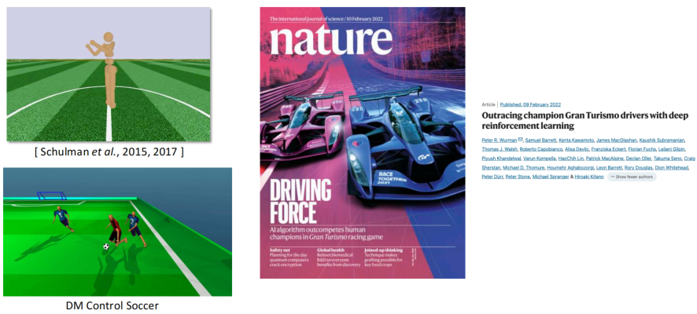
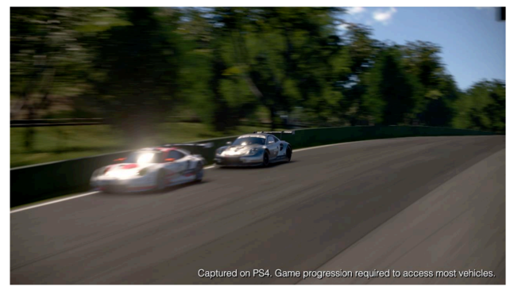
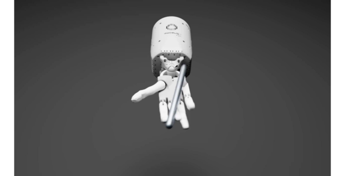
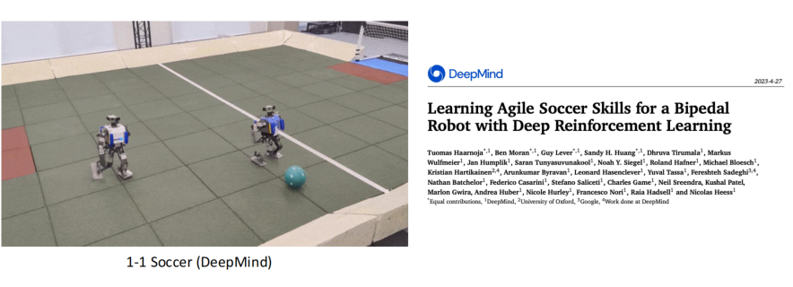
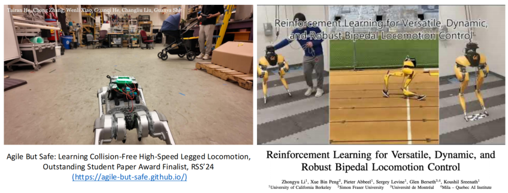
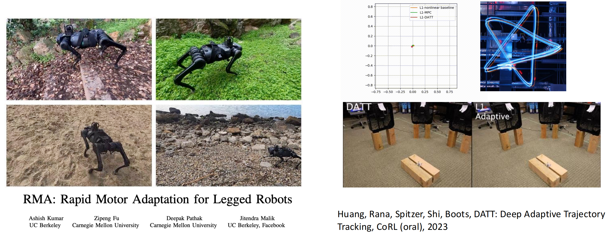
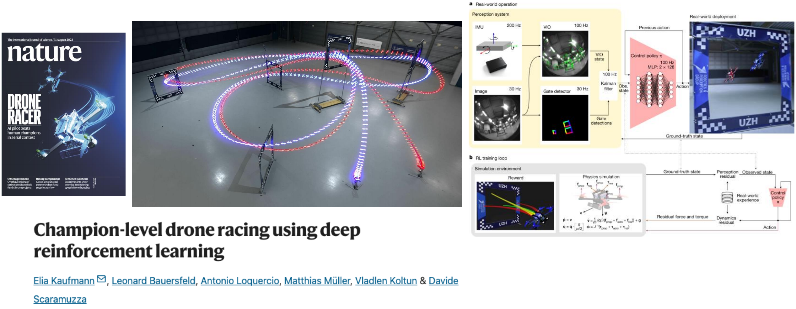

## 机器人学习发展现状

#### 现状：仿真领域的机器人学习
- 仿真领域的机器人

- GT Sophy以一种公平的方式超越人类驾驶员(无碰撞或阻挡)
- 怎么做到的？DRL+分布式训练平台+复杂的奖励设计

- Eureka：转笔
- 怎么做到的？用于设计奖励机制的LLM技术

#### 现状：DRL+Sim2Real
- 在仿真环境下训练，在真实世界进行部署

#### 现状：DRL+Sim2Real+Adaptation
- 在仿真环境下训练，使用实时调整部署在真实世界

#### 现状：DRL+Sim2Real+Adaptation
- 使用真实数据构造/增强/改进一个模拟器，在模拟环境下训练，在真实世界部署

  
