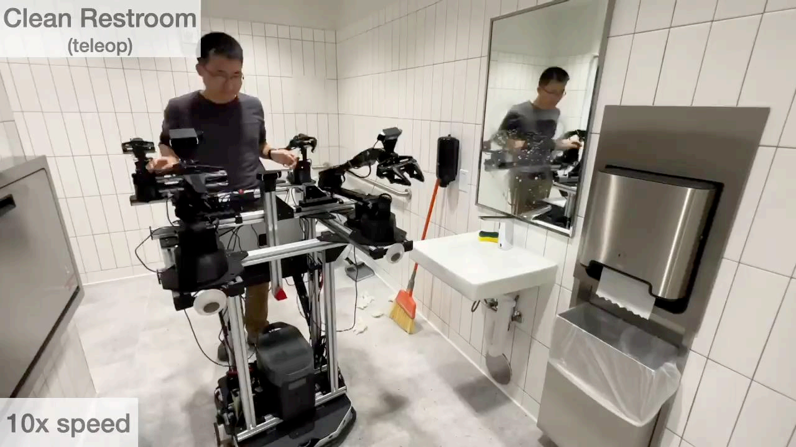

## 机器人学习发展现状

#### 现状：仿真领域的机器人学习
- 仿真领域的机器人

- GT Sophy以一种公平的方式超越人类驾驶员(无碰撞或阻挡)
- 怎么做到的？DRL+分布式训练平台+复杂的奖励设计

- Eureka：转笔
- 怎么做到的？用于设计奖励机制的LLM技术

#### 现状：DRL+Sim2Real
- 在仿真环境下训练，在真实世界进行部署

#### 现状：DRL+Sim2Real+Adaptation
- 在仿真环境下训练，使用实时调整部署在真实世界

#### 现状：DRL+Real2Sim2Real
- 使用真实数据构造/增强/改进一个模拟器，在模拟环境下训练，在真实世界部署

#### 现状：从人类示范中学习(Learning from Demostrations)
- 收集人类示范进行模仿学习

- 遥控操作的示范

- 扩散策略

- 从示范中进行大规模学习
- 物理智能收集了大约1亿个时间步长

#### 现状：基于模型的强化学习(Model-based RL)
- 没有模拟器。从真实世界收集数据 -> 学习一个模型 -> 获取一个策略 -> 部署
- 元学习动态模型(Meta-learned dynamics model) + 在线自适应控制

- 通过学习的"delta"动力学模型将绳子甩到目标点

- 基于DNN动力学+采样的MPC(MPPI)

#### 现状：在线无模型强化学习(Online Model-free RL)
- 没有模拟器。在真实世界上进行无模型强化学习

#### 现状：离线强化学习(Offline RL)
- 没有模拟器。从离线数据中学习
- 与模仿学习不同：不依赖于专家数据

#### 失败案例
- 一些对人类来说很简单的任务上，机器人仍然难以胜任，比如：搬箱子
- 机器人失误集锦

#### 莫拉维克悖论(Moravec's Paradox)
>“困难的问题很简单，但简单的问题却很困难。”
"The hard problems are easy and the easy problems are hard."

>  使计算机在智力测试或下棋上展现出成年人水平的表现相对容易，但当涉及到感知和移动能力时，给他们一岁孩子的技能是困难或者不可能的。
> “It is comparatively easy to make computers exhibit adult level performance on intelligence tests or playing checkers, and difficult or impossible to give them the skills of a one-year-old when it comes to perception and mobility.” (1988)

#### 莫拉维克悖论：为什么？
- 运动控制的困难是否是来自于硬件？
  - 例如：人类的“马达”比机器人好的多
- 答案是否定的。当人类操控机器人时，一样可以完成负责的动作
----------------
- ALOHA系统相对便宜(32k)并且没有太多自由度
  - 2(基座)+12(两个胳膊)+2(两个夹具)
- 我们能认为算法/数据/算力比硬件更重要吗？
- 并没有这么简单。不同部件的耦合是非常重要的。
------
- 人类遥控知道并利用硬件结构
  - 在闭环中完成：感知-计划-控制-行动

#### 一些认知科学视角
- 感知和行动是耦合的。
> 我们拥有大脑只有一个原因，那就是产生适应性强且复杂的动作。
“We have brain for one reason and one reason only, and that’s to produce adaptable and complex movements.” -- Daniel Wolpert
- 例如：乌鸦喝水，乌鸦的控制-感知循环
- 例如：人眼观察与落脚点未知

#### 但是，没有简单的统一方法
- 感知(Perception)：高维输入
  - 如何从原始输入中获得有意义事物的低维流形。
- 控制(Control)：高维输出
  - 指数级搜索空间，其会随着步骤数和动作数的增加而增长
- 感知+控制：高维输入和输出

#### 这就是机器人学习的用处
1. 机器人学习可以统一(或者至少，可以让这些模块彼此交流)。
   
2. 机器人学习也可以改进每个模块，特殊是当它是具身的时候。
- 目前在（2）上面的取得了比（1）更多的进展。