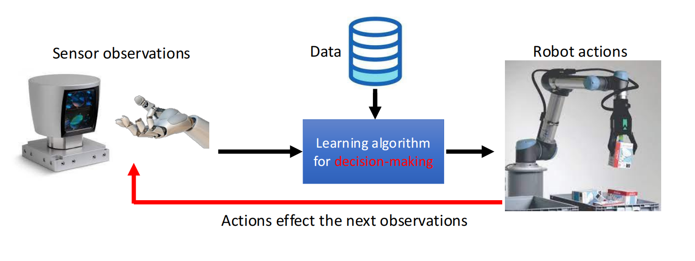
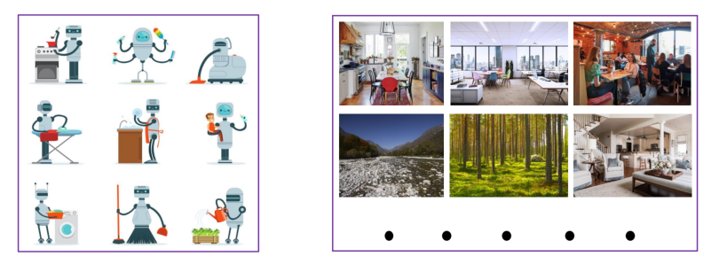
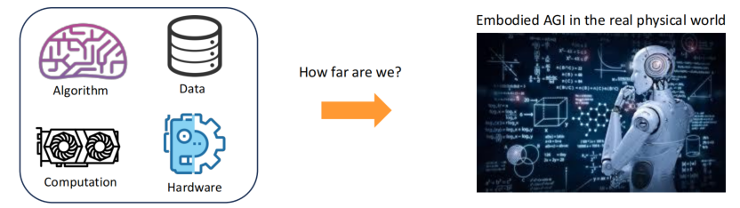
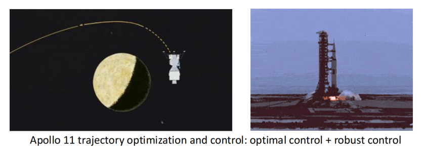
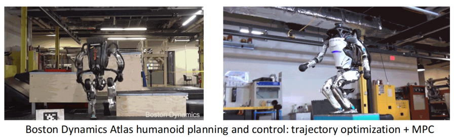
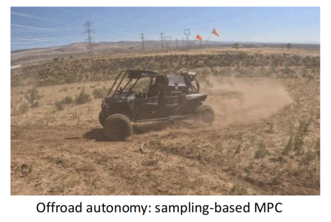
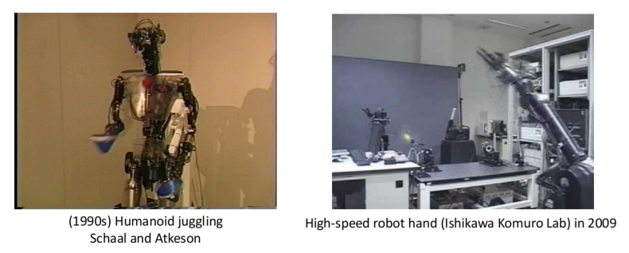
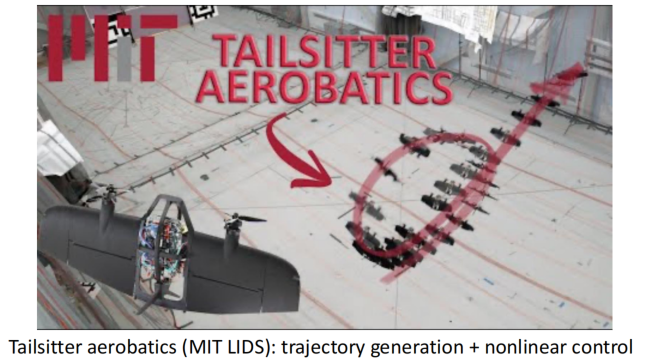
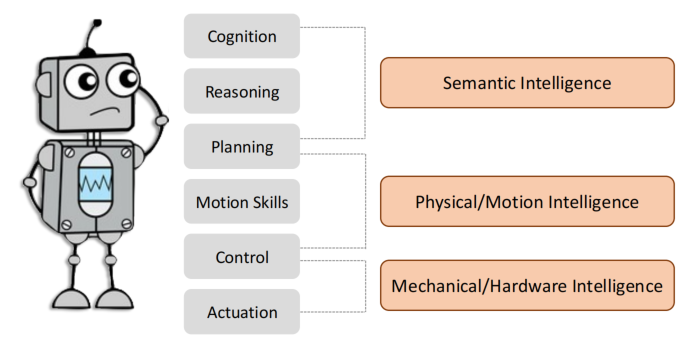

## 前言
### 内容介绍
- 1.什么是机器人学习？它的独特性是什么？(What is robot learning and what is its uniqueness?)
- 2.机器人学习的目标是什么？(What is the goal of robot learning?)
- 3.我们当前处在什么位置？离目标还有多远？(Where are we today? How far are we frm the goal?)
- 4.课程结构及课程目标(Course structure and course objective)
- 5.序列决策在其他领域的应用(Applications of sequential decision making in other domains)

### 1. 什么是机器人学习？它的独特性是什么？
#### 从物理世界中学习做出序列决策。
<!--  -->

- 学习: 由数据驱动并且在数据上改进
    
    - 无学习/数据：搜索、计划、传统控制...

- 序列: 当前的行为/决策影响下个状态，因此影响下一个行为/决策
    
    - 无序列：bandit算法，标准的监督学习...
- 物理世界: 机器人需要在闭环中与物理世界进行交互
  
    - 又名“具身智能”
    - 无物理世界：游戏中的强化学习，LLMNs..

#### 挑战 1（与其他AI或者机器学习领域相比）
1. 数据从哪里来？
2. 如何使用这些数据？

#### 为什么GPT(以及其他VLMs/LLMs)能够成功？
- 架构：transformer
- 数据：网页文本，书籍，维基百科...
- 损失：下一个token预测
- 优化器：SGD
- 生成：自回归

#### 挑战 2（与游戏中的深度强化学习相比，比如Alpha Go）
- 已知、静态 `v.s.` 未知、动态
- 一个指定的任务 `v.s.` 多个任务
-  清晰的优化目标(例如，奖励) `v.s.` 不清晰的目标
-  离线学习就可以 `v.s.` 需要在线适应
-  缓慢的行为 `v.s.` 相对快速的实时的行为(例如，50Hz)
-  允许失败 `v.s.` 现实世界不允许失败(代价太大)
-  离散的数字世界 `v.s.` 连续的物理世界

### “机器人学习”的目标是什么？
- 终极目标：通过学习在物理世界中做出序列决策，创造出<b>通用型具身</b>智能

机器人可以在各种环境下完成各种任务
    

  

- 从算法、数据、算力、硬件 到通用具身智能，我们还有多远

- 不管是基于学习的还是其他的，我们已经在特定领域的具身智能上取得了很大的进展
- 但我们仍然离通用型具身智能非常远
  
### 当前我们处于什么阶段：非学习的方法
##### 不依赖于学习的方法：

    
    
    
    
    
    

  

### 为什么我们需要机器人学习？
- ##### 数据增加了“上限”或者减少了算法、计算和硬件的明确的限制
    - 对世界建模很困难
    - 环境/任务可能会改变
    - 策略的结构可能是有限的
    - 优化求解器可能不是最优的
    - 假设可能覆盖不了所有情况
- ##### 在机器人上非学习的方法通常是每个模块分开设计的
 </img>

