## 前言
- 这个领域的大部分都在快速发展
- 我们需要持续学习
- 许多令人兴奋和有影响力的想法来自其他领域
- 一些有用的资源
  - 深度学习书籍，花书（https://www.deeplearningbook.org/）
  - Patterns,Predictions,and Actions: Foundations of ML
  - Pytorch官网教程：https://pytorch.org/tutorials/
- 不要被花哨的名称迷惑-问问自己，究竟是什么让这个算法/方法在某些领域如此有效
- 今天行不通的东西，明天可能行得通
- 理论和实践之间往往有很大的差距
  - 例如1：在2008年，伊尔亚·苏茨克维尝试说服在座的每一个去研究DNN。每个人都知道DNN在那时是行不通的。
    
  - 例如2：过度参数化在学习理论中(以及经验上)都是一个坏主意。
    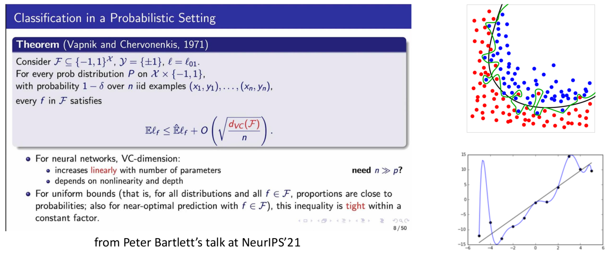
  -  但实际上，过度参数化模型工作的越来越好。
     -  现在有一些好的理论解释(例如：SGD的隐式正则化)
    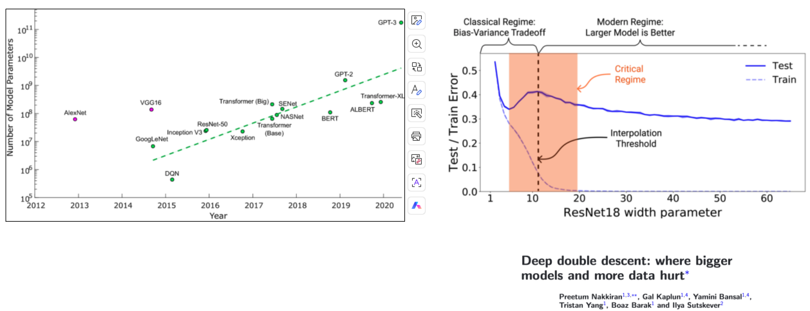

## 大纲
- 监督学习基础
  - [什么是监督学习？](#什么是监督学习)
  - [模型/架构，训练数据，损失，学习目标，优化](#模型架构训练数据损失学习目标优化)
  - [例如：线性回归](#例线性回归)
  - [泛化性，过拟合，欠拟合](#例线性回归)
  - [监督学习的概率方法](#监督学习的概率方法)
- 深度学习
  - 为什么是深度学习？
  - 全连接神经网络（DNNs）
  - 怎么训练DNNs

## 什么是监督学习
### 监督学习的基本思想
- 学习一个函数$f$：$X \to Y$从输入空间$X$(观测值)到输出空间$Y$(目标值)，使用一个有标注的样例集合$ D_{train}=(x_1,y_1),...,(x_n,y_n)$
- “泛化能力”：理想情况下，这个学习到函数$f$会在测试数据(不包含在$D_{train}$)上表现很好
- 例如：图像分类
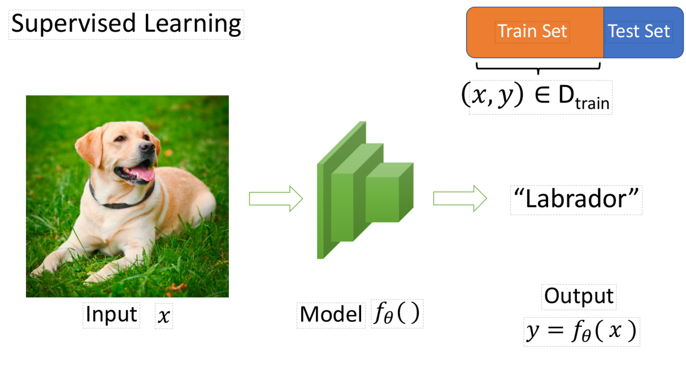
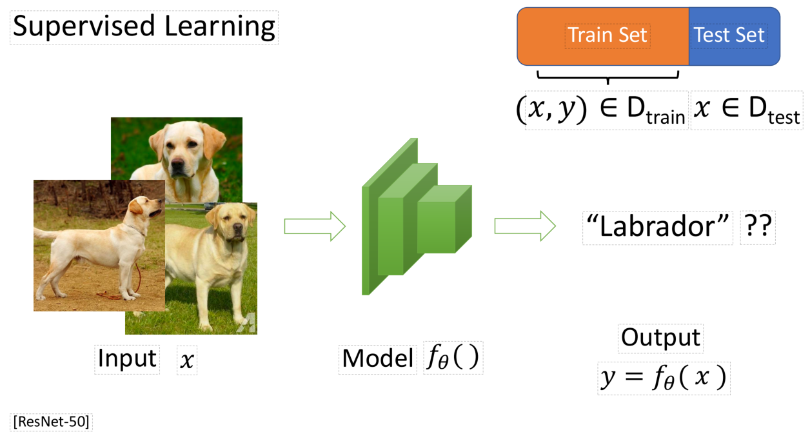

### 为什么这么难？
- 我们看到的以及计算机看到的：
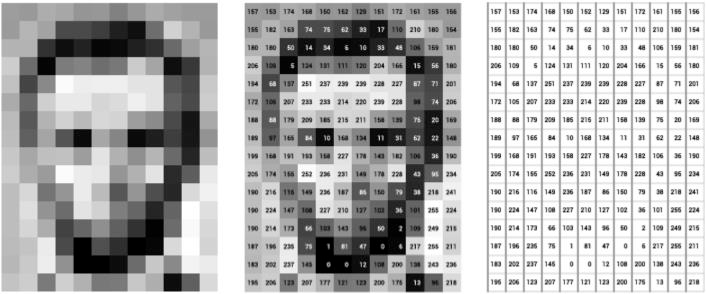
- 这就是什么我们需要学习。从“复杂”数据中抽取模式。

### 监督学习的类别

  

    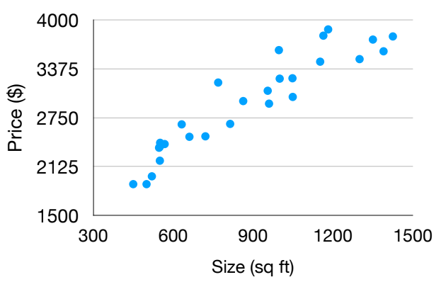

\
    回归：预测真实值 y

$Y=\mathbb{R}$ or $\mathbb{R}^n$
 +more...(e.g., object detection)
  

  

    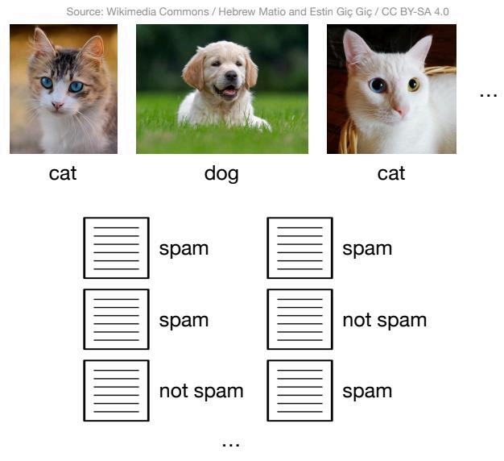
    分类：从一个固定的有限集合中预测一个类别y
  

## 模型/架构，训练数据，损失，学习目标，优化
## 例：线性回归
$D_{train}$：蓝点；$D_{test}$：绿点
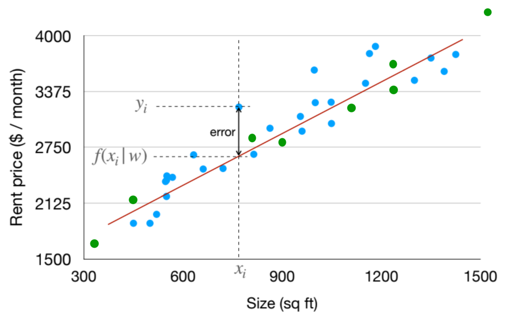

- **模型：** 拟合一条直线 $f(x|w)=w^tx$(r通过引入“虚拟特征”$x=[1;x]$，将偏差包含在$w$中)
- **训练目标：**$y_i\approx f(x_i|w)$
- **损失：** 平方损失$L(y,y')=(y-y')^2$
- **学习目标：** $\displaystyle arg\mathop{\min}\limits_{w}\sum_{i\in D_{train}}L(y_i,f(x_i|w))$
- **泛化性：** $L(y,f(x|w))$在绿点(测试集$D_{test}$)上是很小的
  - 插值法(Interpolation) v.s. 外推法(extrapolation)
  - 域偏移(Domain shift)：$D_{train}$和$D_{test}$来自不同的分布
- **过拟合：** 测试误差 >> 训练误差
- **欠拟合：** 测试误差和训练误差很相似，都很高
- **优化：** 优化学习目标
  - 闭合形式解(Closed-form solution) $w=(X^TX)^{-1}X^TY$
  - 梯度下降法：$w\leftarrow w-\eta\nabla_wL_n(w)$
  - SGD：$\displaystyle w\leftarrow w-\eta\nabla_w\sum_{i\in Batch}L(y_i,f(x_i|w))$
  
### 不只是线性回归
机器学习的基础（不管你使用什么模型）
- **模型/架构，训练数据，损失，学习目标，泛化性，过拟合，欠拟合，优化**
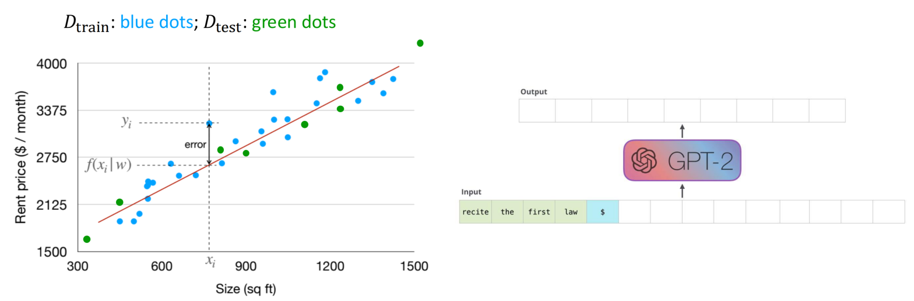

### 优化：GD v.s. SGD
- **学习目标：** $\displaystyle arg\mathop{\min}\limits_{w}L_N(w) =\sum_{i\in D_{train}}L(y_i,f(x_i|w))$
- **梯度下降(GD)：** $w\leftarrow w - \eta\nabla_wL_N(w)$
  - 如何训练数据集很大的话，成本可能非常高
- **小批量随机梯度下降(SGD)：** $\displaystyle w\leftarrow w-\eta\nabla_w\sum_{i\in Batch}L(y_i,f(x_i|w))$
  - 在线优化算法（每次只需访问一个批次）
  - 使用快速向量运算（尤其是在GPU上）
  - 能够并行（例如，不同的核在不同的小批次上计算梯度）
  - 不只是深度学习：即使在大型数据集上，对最小二乘回归也很有用
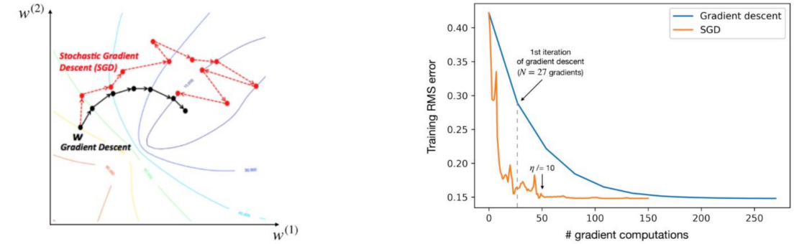

### 优化：学习率
- 如果太大，算法可能会震荡甚至发散（左图）
- 如果太小，算法可能需要很长时间才能收敛（右图）

  

- 理想情况下，我们希望$\eta$尽可能大，而不会发散
- 实用经验技巧：
  - 损失除以样本数量（**标准化**）
  - 从较大的步长开始
  - 当**验证集**误差停止下降时，降低步长，例如$\eta_{t+1} \leftarrow \eta_t/2$
  - 当验证集误差不再下降时，停止训练（**提前停止**）
  

  

    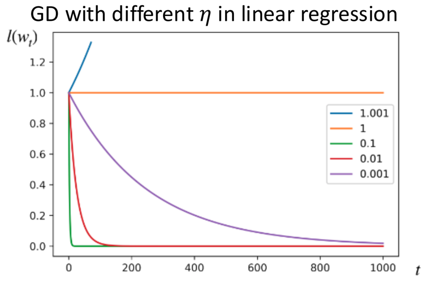
  

### 优化：超越SGD

  

- 非凸问题很难优化
  - 多个局部极小值
  - 好消息是：在深度学习中，我们并不真正关心找到全局最优解
  - 找到一个好的局部最优解非常重要
- 许多优化方法超越了SGD
  - Momentum, AdaGrad, RMSProp, Adam, ...
  - 目标是提供鲁棒性和效率
  - 诸多权衡考量
  - 例如：momentum是如何运作的。
  

  

    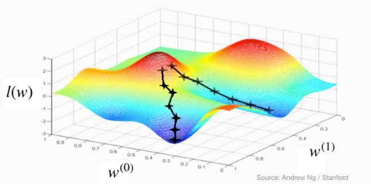
    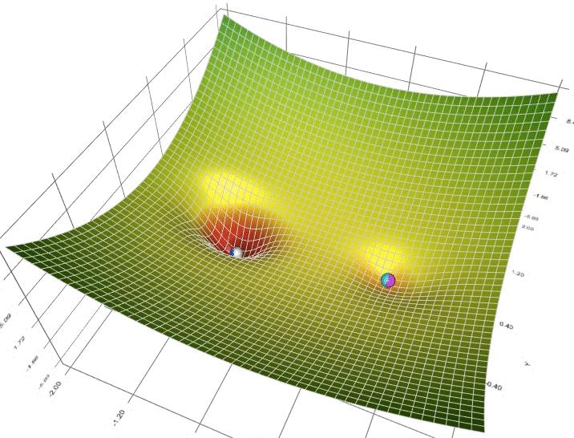
  

  

    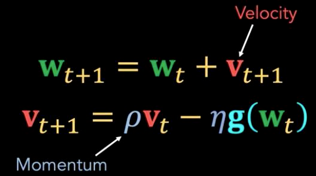
  

  

    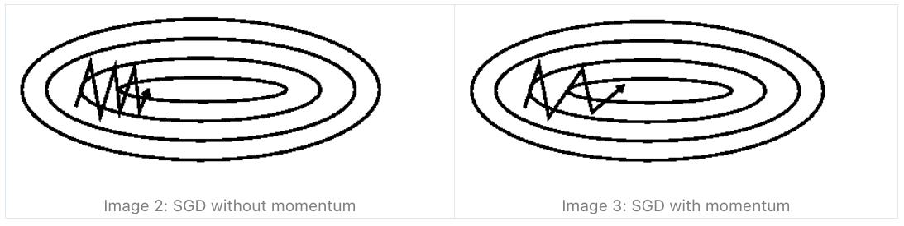
  

`https://www.ruder.io/optimizing-gradient-descent/`

### 优化：正则化
- 在$w$或$f(x|w)$上添加一些“归纳偏置”
  - 例如：稀疏(sparsity)，平滑(smooth)等

  

- 两类正则化：  
  - 最小“能量”的岭回归$(R(w)=||w||^2)$
  - 针对稀疏性的Lasso$(R(w)=||w||_1)$
  

  
 
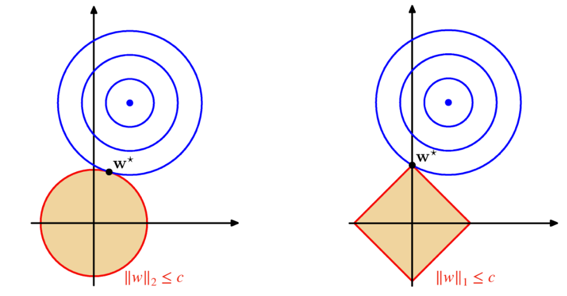
  

- 对机器人学习很有用
  - 例如：平滑动态学习和平滑模仿学习

  

    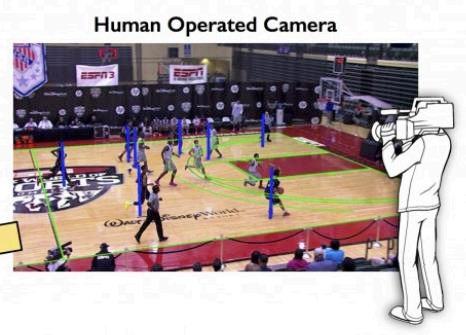
  

  
 
    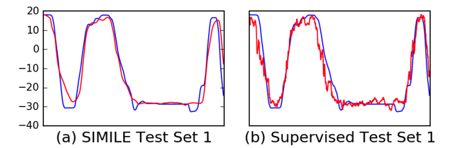
  

`Hoang et al., Smooth Imitation Learning for 
Online Sequence Prediction, ICML’16`

### 期望的测试误差与偏差-方差分解
- 将模型参数$w=w_d$视为训练数据集$D$的函数
- $D$由N个来自概率$P(x,y)$的独立同分布的样本组成（无域偏移）

$\displaystyle w_D=arg\min_w\sum_{i\in D}L(y_i,f(x_i|w))$

- 期望的测试误差：

$\mathbb{E}_D\mathbb{E}_{(x,y)\sim P(x,y)}[L(y,f(x|w_d))]$

- **统计学习理论：** 将量化^作为$N,f$和$P$的函数

  

- 假设平方损失的偏差-方差分解：
  - $F(x)=\mathbb{E}_D[f(x|w_d)]$是模型的平均预测值

$\mathbb{E}_D\mathbb{E}_{(x,y)\sim P(x,y)}[L(y,f(x|w_d))]$
=$\mathbb{E}_{(x,y)\sim P(x,y)}[\mathbb{E}_D[(f(x|w_D)-F(x))^2]+(F(x)-y)^2]$

其中，方差为：$\mathbb{E}_D[(f(x|w_D)-F(x))^2]$；
偏差为：$(F(x)-y)^2$
- 过拟合意味着高方差
  - 方差随模型复杂度增加而增大
  - 方差随训练数据的增多而减小
- 欠拟合意味着高偏差
  - 当模型复杂度过低时会发生高偏差
  - 极端情况：$f(x|w_D)=$ 常量，没有方差
  

  
 
    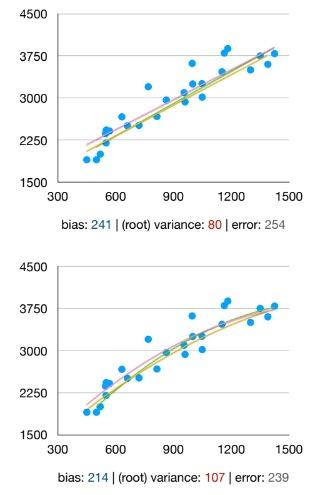
    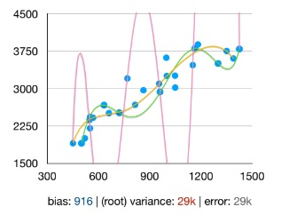
  

- 然而，当模型非常大时，这种权衡可能不成立！
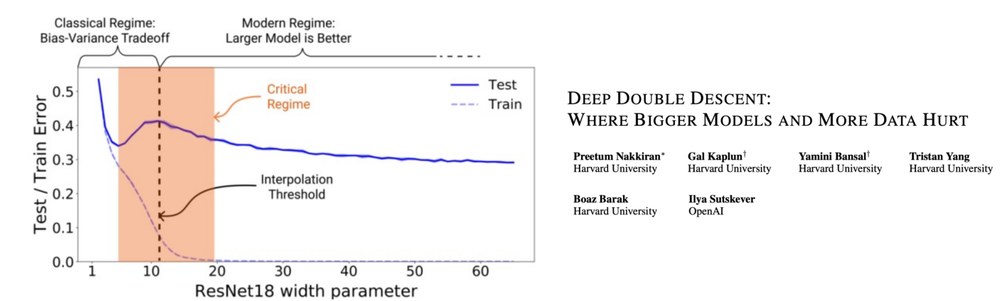

### 模型选择和验证集
- 我们如何从这些模型中进行选择并调整诸如学习率之类的超参数？
- 只有训练集的话 -- 无法衡量真实的测试误差
- 机器学习的关键原则：“测试和训练条件必须匹配”(Vinyals等人，一次学习的匹配网络)

- 将原始数据集拆分成**训练**集和**验证**集
- 在训练集上训练模型
- 在验证集上进行评估，以估计测试误差
- 也可以用k-fold方式进行这个过程（将原始数据分成k个等份）

### 监督学习的概率方法
- 到目前为止，这个想法是：找到一个参数$w$，使得对于$(x_i,y_i)\in D_{train}$，$y_i\approx f(x_i|w)$成立.

- 概率视角：
  - 对概率分布建模。给定输入$x$标签$y$的概率为$P(y|x;w)$ 
  - 为$P(y|x;w)$选择一个“**模型**”（形式）
  - 编写$w$的似然函数，即给定输入$x$时，观察到的训练集$D_train$中标签$y$的概率。

 

$P(D_{train}|w) = \prod_iP(y_i|x_i;w)$

- - 学习目标（**极大似然估计，MLE**）：找到一个$w$使得对数似然最大化：

 

$\displaystyle arg\min_wlogP(D_{train}|w) = \sum_ilogP(y_i|x_i;w) = -L(w)$

- 贝叶斯视角：用先验概率来衡量这种可能性

$P(w|D_{train}\propto P(D_{train}|w)P(w)$

### 例：逻辑回归(Logistic Regression)

  

- 二分类：预测被标记为$(f(x|w))\in \{ +1,-1 \}$
- 想法：我们希望使用原始得分对每个类别的概率建模：$\sigma (f(x|w)) \approx y=+1$的概率
  - $\sigma$：logistic/sigmoid函数
  - 非常有用的特征：$\sigma'(a)=(1-\sigma(a))\sigma(a)$
- 在训练数据集上最大化$w$的对数似然：

$\displaystyle logP(D_{train}|w)=\sum_i1_{\{y_i=+1\}}log\sigma(f(x_i|w))+1_{\{y_i=-1\}}log(1-\sigma(f(x_i|w)))$

- - 又称，对数损失，二值交叉熵损失
  - 梯度：$-(1_{\{y_i=+1\}}-\sigma(f(x_i|w)))\cdot\nabla f(x_i|w)$

  

  
 
    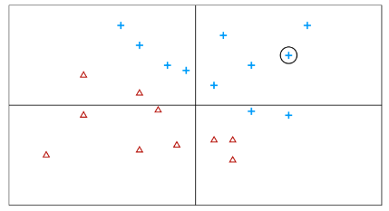
    

    
    $\sigma(a)=\frac{1}{1+e^{-a}}$
    

    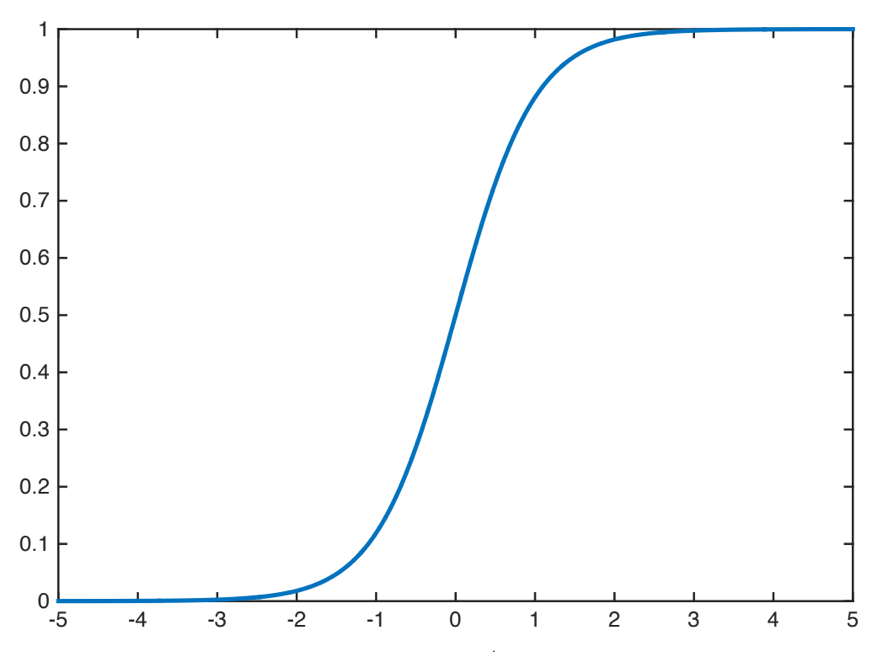
  

### 多类别逻辑回归
- 将sigmoid替换为softmax

$softmax \begin{bmatrix}a_1\\a_2\\.\\.\\.\\a_k\end{bmatrix}=\frac{1}{\sum_{k=1}^Kexp(a_K)}\begin{bmatrix}exp(a_1)\\exp(a_2)\\.\\.\\.\\exp(a_k)\end{bmatrix}$

- 例：$K=3, Y=\{dog, cat, lion\}$
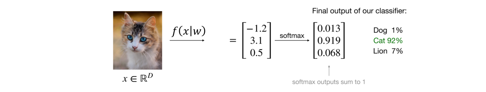

- 交叉熵损失（逻辑损失是当K=2时的特例）

$\displaystyle \sum_i\sum_{k=1}^K1_{\{y_i=k\}}log softmax(f(x_i|w))_k$

### 总结：监督学习流程
以线性回归为例：
- **训练数据集：** $D_{train}=(x_1,y_1),...,(x_n, y_n)$
- **模型：** $f(x|w)=w^tx$
- **损失函数：** $L(y,y')=(y-y')^2$
- **学习目标：** $\displaystyle arg\min_w\sum_{i\in D_{train}}L(y_i,f(x_i|w))$
- **优化：** DG,SGD, ...
  - 学习率很重要
- 监督学习的概率方法
  - 例：逻辑回归

### 机器人中的监督学习
- 训练集：$D_{train}=(x_1,y_1),...,(x_n,y_n)$
- y可以是很多东西
  - 动力学（基于模型的RL和控制）
  - 行动（模仿学习）
- 如何生成有一集如何使用它更为重要
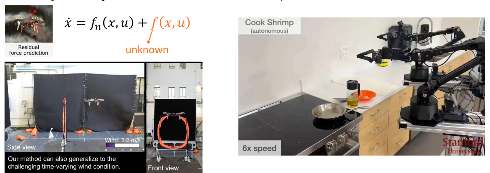

### 深度学习：为什么？
图像分类的线性逻辑回归：它有效吗？
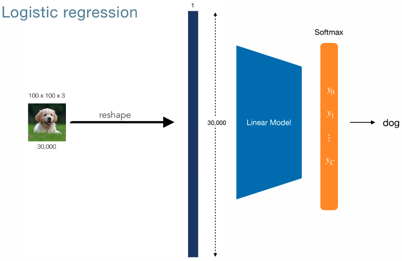
- 问题：线性模型$(f(x|w)=w^tx$或者$w^t\phi(x)$ **独立** 考虑每个特征，并回归其对标签贡献的权重$w$
- 但在图像中，单个特征（像素）没有意义。重要的是像素之间的关系。
  - 例如：要识别一个人，我们需要观察部分和部分之间的关系

- 理论上，我们可以编写一个嵌入$\phi(x)$来编码所有这些特征。但我们难道不能学习它吗？

### “人工”神经元模型
- 用代码复制生物神经元
- 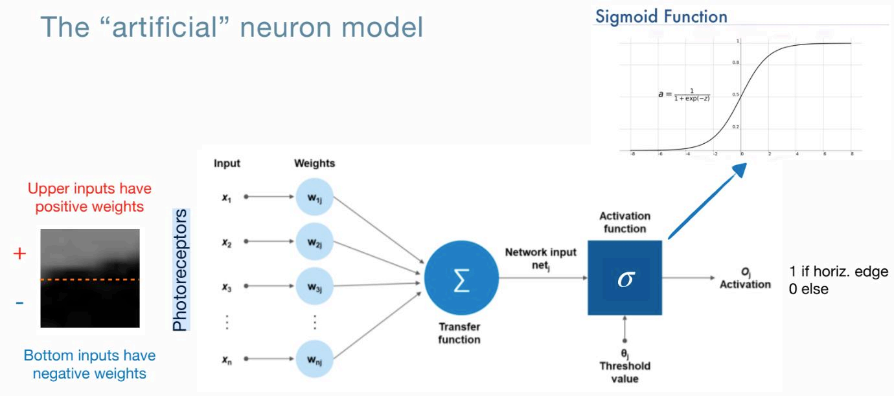

## 深度神经网络
- 一“层”
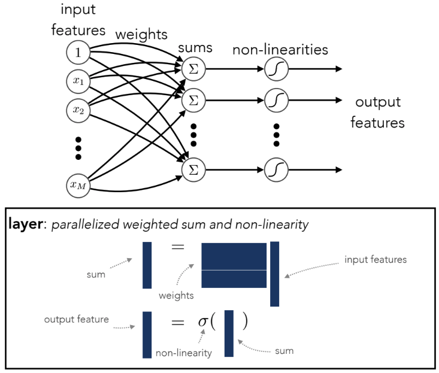
- 多层
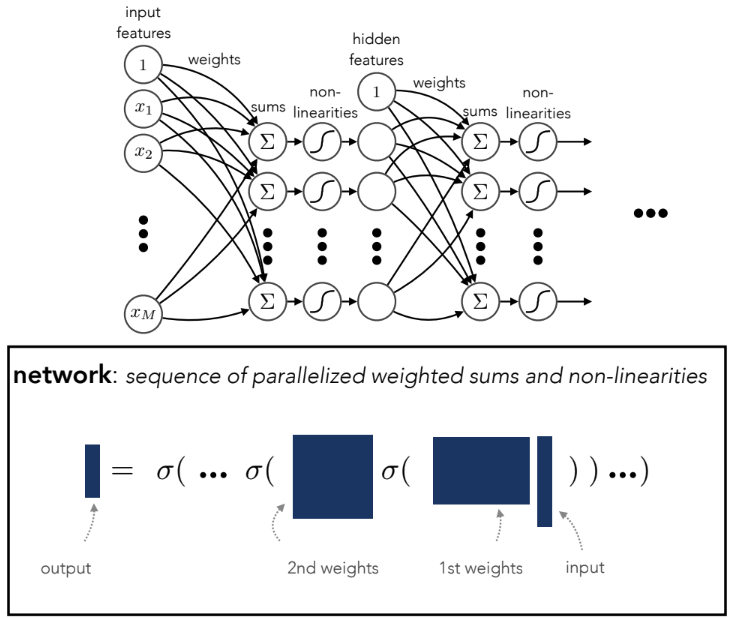

### 非线性的作用
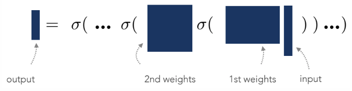
- 如果我们没有非线性，整个网络将坍缩成一个线性函数
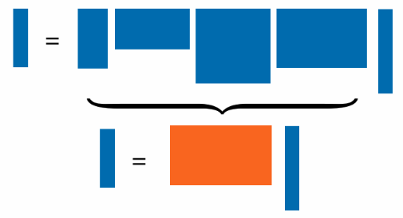

### 非线性的作用：几何视角
- 线性部分$w^tx$定义超平面
- 非线性“转换”了这个距离
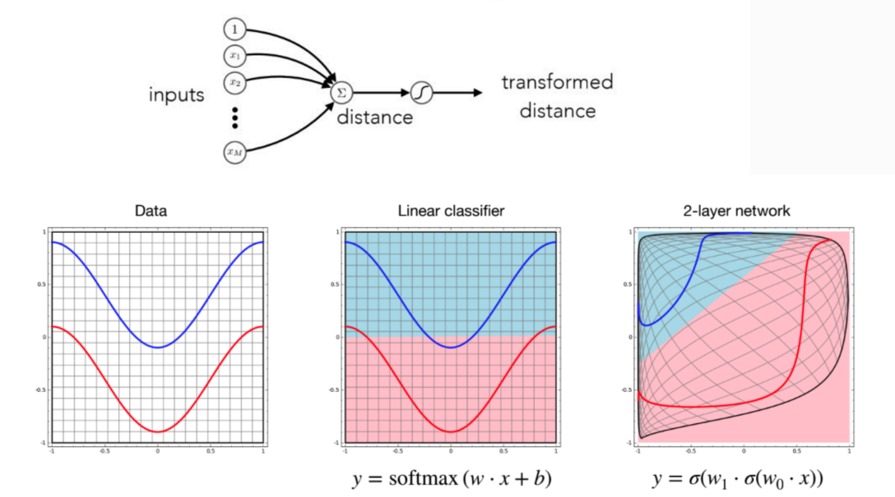

### DNNs是通用函数近似器
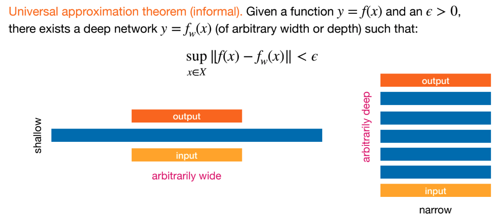

- 注：某些版本要求真实函数是连续的。
- 注：这意味着一个网络可以表示任何函数，而不是它能学习它！
  - 给定网络可以表示的函数的“量”通常被称为其表达能力（在学习理论中的正式定义）。

### 训练一个DNN
- 我们可以继续使用SGD吗？ $\displaystyle w\leftarrow w-\eta\nabla_w\sum_{i\in Batch}L(y_i,f(x_i|w)$
- 是的。小批量梯度下降仍然有效。但是怎么计算$\nabla_w$?
- 问题：$w$有成百上千万的参数，我们不能天真的计算所以的梯度
- 解决方案：**反向传播**
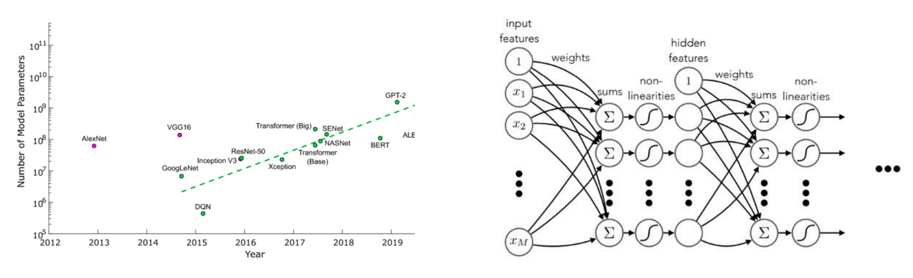

### 反向传播
- DNN本质上是一个函数的组合
- 所以，我们可以使用链式法则
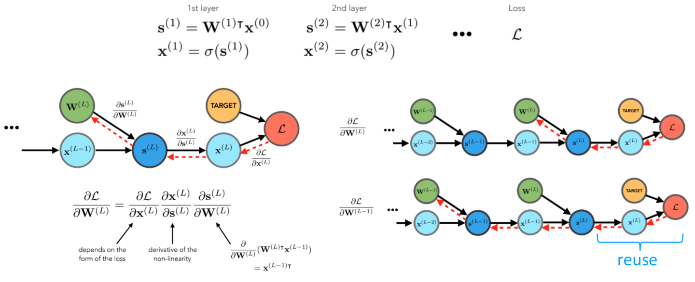
- 我们可以使用反向传播来计算任何计算图上的梯度

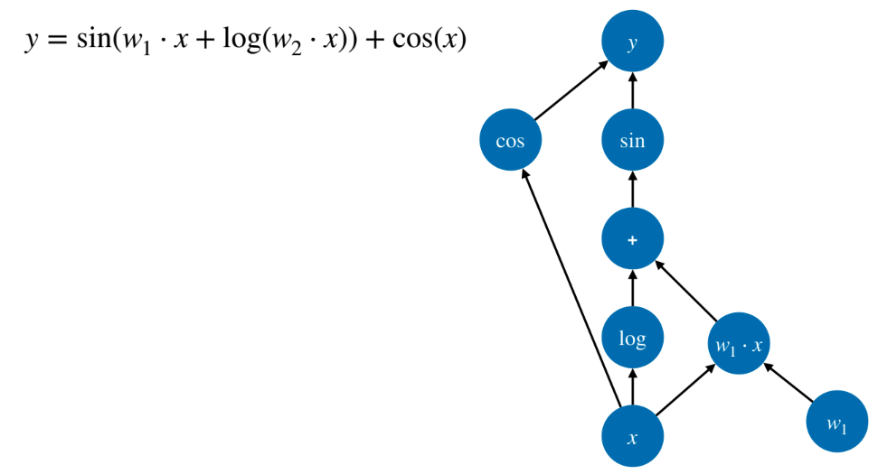

- 现代的深度网络可以有非常复杂的结构
- 实践中的自动微分（使用深度学习软件库）

### DNNs是高度可并行化的
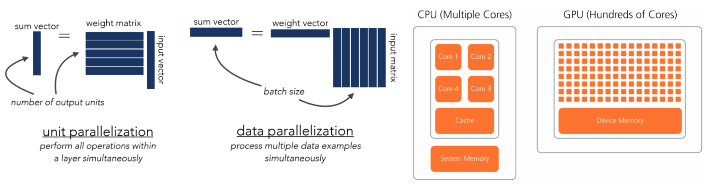

### 梯度消失

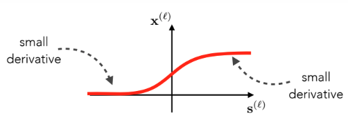

- 饱和非线性几乎处处具有小导数
- 在反向传播中，许多小项的乘积为零

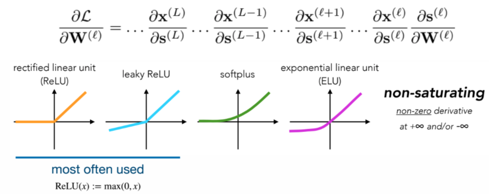

### 网络如何更深
- 除了非饱和激活之外，许多技术也被开发出来，用于稳定深度神经网络的训练（缓解梯度消失和梯度爆炸）

  

- - 权重初始化
  - 批量归一化
  - 学习率退火
  - 残差连接
  - ...
  

  
 
    
  

- 为什么是残差连接？
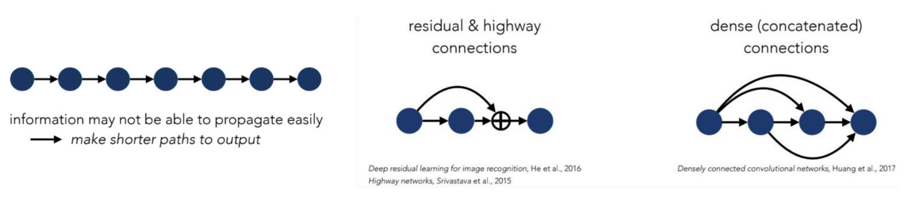