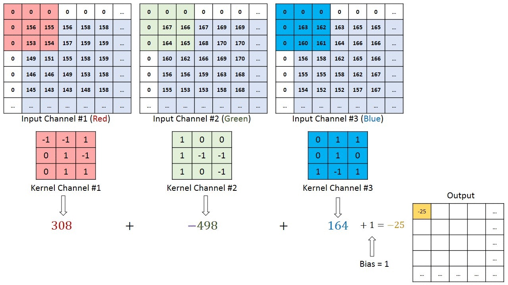
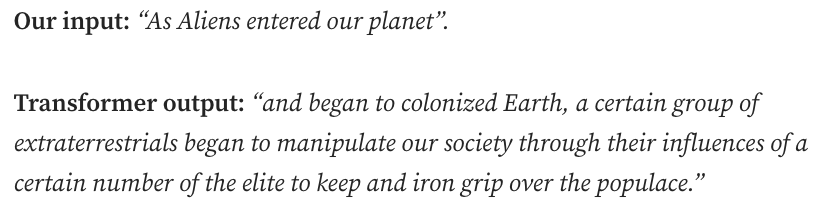

## 前言
本文主要回顾深度学习相关算法，具体入下：
- 深度学习模型（CNN, RNN/LSTM, transformer）
- 无监督学习，生成式模型
- DNN的不确定性量化，DNN的验证

### 卷积神经网络

  

- 回顾**全连接网络**:
- **CNN：** 通过应用相关过滤器，捕获图像中的空间依赖关系
  - 卷积核(Conv kernel)，步长(Stride length)，填充(padding)
  

  

    
  

  

- 步长为2，kernel为3x3x3的卷积操作
- 将5x5x5图像用0填充，来创建3x3x1的特征图

  

  

  
步长为1，kernel为3x3x3的卷积操作

    
  

  

- 池化(Pooling)（下采样(downsampling)）:
  

  

 
    
  

- 例：LeNet(1998)

- CNN基于两个归纳偏置

- 为什么叫“卷积”？
- 因为数学中的卷积运算符
- 两个函数的卷积输出一个新的函数
  - $f$: filter/kernel; $g$: image; $f*g$: 新图像(特征图)

### 其他：等变性和不变性

  

- 等变性: $f(g(x))=g(f(x))$
  - 图片中物体变大，特征图中的物体也相应的变大
- 不变性：$f(g(x))=f(x)$
  - 图片中物体变大，结果不变
  

  

    
  

  

引入等变性/不变性的两种方法
- 设计神经网络
- 数据增强
  

  

    
  

### 时间序列

- 任务：分类，预测，序列to序列, ...

  

  
  

  

    
  

### 循环神经网络(RNN)
- 为了反映数据的序列结构，我们可以按序列处理数据
  - **隐藏状态：** 对可能与未来相关的所有历史信息进行汇总。在处理过程中保留内部表示

- 问题：学习扩展的序列依赖关系需要在较长的时间范围内传播梯度（红色虚线）
  - 梯度消失/梯度爆炸
  - 内存/计算资源占用大
  
### 长短期记忆（LSTM）
- 为网络添加可训练记忆
- 从“单元”(cell)读取并写入

### 注意力(Attention)和Transformer
- 卷积时一种局部注意力的形式

- 但是许多任务需要非局部注意力
  - 注意力机制使得transformers具有极长的长期记忆

### Transformer：Attention Is All You Need

  

- 高层次理念：**编码器**将输入序列映射到一个表示。**解码器**接着使用该表示，逐步生成一个输出，同时输入前一个输出。
[Atention Is All You Need](https://arxiv.org/pdf/1706.03762)
  

  

    
  

  

 

- **输入嵌入(Input embeddings)**：词到向量
- **位置嵌入(Positon embeddings)**：需要位置信息，因为transformer不像RNN那样具有循环性。

  

- **编码层(Encoder layer)**：输入->连续的表示
  - **多头注意力(Multi-headed attention)**，然后时全连接NN
  - 有残差连接
  - 层归一化
  

  

  

    
  

    
  

### 编码层 (Encoder Layer)
- 编码器中的**多头注意力(Multi-headed attention**使用了一种被称为“自注意力”的注意力机制。
  - 将输入中的每个单词与其他单词联系起来

  

- 我们将输入喂给3个不同的全连接层，以创建query(Q)、key(K)和value(V)向量。
  - Q和K的点积得到一个得分矩阵
  - 分数决定了两个单词之间的“注意力”
  - 然后，将分数按Q和K的维度进行缩放
  - 将得分的softmax与V相乘，得到输出向量

  

  

  

      
    
  

### 自回归解码器(Autoregressive Decoder)

  

- 解码器是**自回归**的，它以一个起始token开始，并将一个先前输出的列表作为输入，以及包含来自输入的注意力信息的编码器输出。
- 与编码器层非常相似，但计算输入表示的 **“交叉注意力”**。
- 输出词典中最可能出现的词。
    

      
    

  

  

    
    
  

### 为什么Transformer有效？
- 它很**简单**（矩阵加法/乘法，ReLU, softmax）：没有归纳偏见
- 它具有高度可扩展性(scalable)！
- 与CNN/RNN或LSTM/MLP相比：
  - CNN：有限的卷积窗口大小（局部性）
  - RNN/LSTM：训练速度非常慢，梯度消失
  - MLP(全连接神经网络)：密度较高，但参数过多，也无法处理可变大小的输入。

  

### Transformer的应用
- NLP: GTPs, Gemini, LLaMA等等
- 以及许多其他的领域

## 无监督学习 (Unsupervised Learning)
- 与监督学习不同，无监督学习算法**仅从未标注的数据**中学习“模式”
- 一些无监督学习的场景
  - 聚类(Clustering)
  - 降维(Dimension reduction)
  - 生成模型(Generative models)
- 相关概念：**自监督学习**
  - 模型在任务上**使用数据本身来生成监督信号**，而不是依赖于外部标签.

***
### 聚类(Clustering)
- 聚类是数据的“摘要”
- 基于质心的聚类：K-Means

  

无标签的数据集

  

K-means目标(无y!)：

  

  

  

    
    
  

***
### 降维(Dimension Reduction)

  

- 通过“投影”汇总数据(Summarize data via "projections")
- **主成分分析PCA**(principal component analysis)或者**SVD**
  - 将原始特征投影到低维空间，同时尽可能多地保留方差。
- t-SNE(t-distributed Stochastic Neighbor Embedding, t分布随机邻域嵌入)
  - 非线性
  - 针对高维数据可视化的有用工具
- Going "deeper":
  - 用于重建的编码器-解码器模型
  - 深度表征学习

  

  

  

    

    
    

    
  

***

  

### 生成模型
- 什么是生成模型？
  - 学习：学习一个“匹配”$p_{data}$的分布$p_\theta$
  - 采样：生成新数据，$x_{new}\sim p_\theta$
- 难题！分辨率为1400x700的图像的可能性为：$256^{1400x700x3}\approx 10^{800,000}$

  

  

     
    
  

> Richard Feynman: “What I cannot create, I do not understand”
Generative modeling: “What I understand, I can create”

***
### 机器人学中的生成模型
- 模仿学习(Imitation Learning)
  - 收集专家数据：$p_{data}$
  - 学习一个模型$p_\theta$
  - 然后进行抽样和泛化
- 通常是有条件的

- 生成式模拟

***
### 生成模型
- 三个最流行的范式：
  - VAE(Variational autoencoder, 变分自编码器)
  - GAN(Generative adversarial network，对抗生成网络)
  - Diffusion model(扩散模型)
- “不可能”的三角：覆盖率、速度、质量

> https://pub.towardsai.net/diffusion-models-vs-gans-vs-vaes-comparison-of-deep-generative-models-67ab93e0d9ae

***

  

### VAE
- 目标：找到$\theta$使得，对数似然最大化

  

  

     
    
  

- 棘手，需要检查所有可能的z并汇总它们
  - 想法：学习一个编码器$q_\phi(z|x)$来近似真实的后验分布$p_\theta$(z|x)
  - 最小化KL散度（经过一些代数运算后）：

>https://lilianweng.github.io/posts/2018-08-12-vae/

- 新问题：很难通过采样过程$z\sim q_\phi(z|x)$进行反向传播
  - 想法：重参数化技巧。使用高斯函数来进行参数化$q_\theta(z|x)$

- 整体示意图：

***
### GAN
- 受博弈论启发。这是一个由两个模型构成的零和博弈：生成器和判别器。

- GAN的问题：很难实现纳什均衡，梯度消失，模式崩溃

- 改进：
  - **更好的散度**：原始的GAN采用JS(Jensen-Shannon)散度在函数控件中并不平滑。例如：Wasserstein GAN(WGAN)
  - **更好的优化**：例如：频谱归一化(判别器的Lipschitz归一化)；竞争性梯度下降。
  - **更好的模型类别和损失设计**：DCGAN, CycleGan等等

***

  

### 扩散模型
- VAE和GAN都是“one-shot”模型
  - 如果我们使用马尔可夫链呢？
- 扩展模型的灵感来自SDE和非平衡热力学：
  - dim(z) = dim(x)! 在GAN/VAE中，dim(z) << dim(x)
  
  

  

     
    
  

- **前向扩散过程**：采样一个真实数据$x_0$，并且逐渐的用独立同分布的高斯噪声来腐蚀它

- - 良好的特性（来自马尔可夫和重新参数化）：$x_t=\sqrt{\overline \alpha_t}x_0+\sqrt{1-\overline \alpha_t}\epsilon$
- - $\alpha_t=1-\beta_t , \overline \alpha_t=\prod_{i=1}^t\alpha_t$. 这意味着我们可以在任何步骤中任意采样。

***
### 去噪扩散概率模型(DDPM)
- **反向扩散过程**：学习高斯概率$p_\theta(x_{t-1}|x_t)$，然后从$x_t$中重建$x_0$。

- 与VAE类似，使用**变分下界**和**参数重置技巧**。经过一些简化后：

***
### DDPM和基于分数的扩散模型

- **随机梯度朗之万动力学**的联系
  - 基于物理学原理的概念。它仅使用对数梯度从$p(x)$中生成样本。

- - 当$t\to \infty, \delta\to0,x_t$等于真实概率$p(x)$
- - **基于分数的生成模型**：学习一个噪声条件评分网络，$s_\theta(x,\sigma)$来评估真实分数(Song & Ermon, 2019)
- - $\epsilon_\theta(x,t)$在DDPM中可以视为一个（缩放的）评分函数
- 更多阅读：https://yang-song.net/blog/2021/score/

***
### 扩散模型
- DALL·E 3生成的文生图

***
### 机器人学习中的不确定性量化
- 操作（抓取）[Shi et al., 2021]:

- For MBRL[Chua et al., 2018]:

***
### 不确定性量化方法
- 使用概率模型和贝叶斯方法
  - 例如：贝叶斯神经网络、高斯过程、dropout
  

  

    

    
    

  

  

     
    
  

- 集成方法
  

    
  

- 符合性预测：针对任意的黑盒预测器
  - 计算得分及其1-$\alpha$分位数
  - 然后为新样本寻找预测集

***
### DNN验证
- DNN是**脆弱的**

- 目标：验证$x\in X \Rightarrow y=f(x)\in Y$
  - 例如：带扰动的分类

- - 方法：可达性、优化、搜索
- - 更多阅读： "Algorithms for Verifying Deep Neural Networks" (Liu et al., 2019)