### 大纲
- 使用能力强模型的模仿学习：使用历史、多模态...
- 基于特权教师的模仿学习
- 通过生成模型进行深度模仿学习
  - 非常活跃的研究领域

***
### 使用历史
- 记住：$o_t$是观测值
- 想法：学习$\pi_\theta(a_t|o_1,...,o_t)$
  - $\pi_\theta(a_t|o_t)$：如果我们看到同样的事情两次，我们就会做同样的事情两次，不管之前发生了什么--这对人类示范者来说并不自然。
- 问题：做$\pi_\theta(a_t|s_1,...,s_t)$有意义吗？
  - 从马尔可夫视角：没有必要...
  - 从机器学习视角：是的！
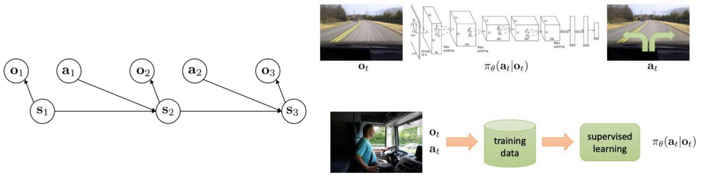

- 如何表示$\pi_\theta(a_t|s_1,...,s_t)$？
- “全连接”？
  - 帧数可变且权重过多

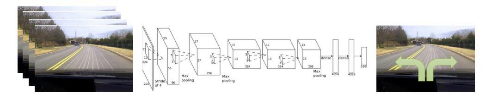

- 时间序列模型

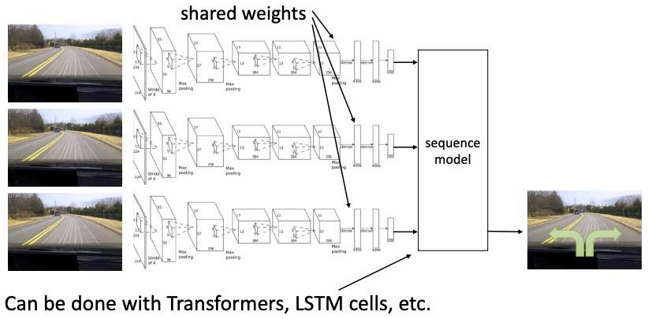

***
### 建模多模态行为(Model Multi-modal Behavior)
- 对于很多示范者来说，多模态行为是正常的
  - 人类示范者
  - 优化控制
  - oracle搜索算法
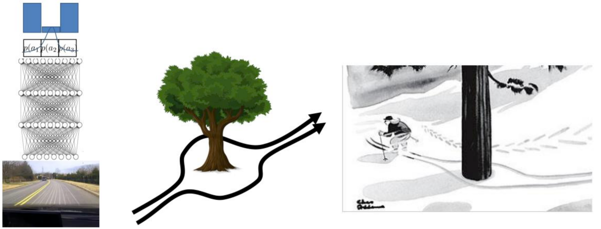

  

 

- 如何建模多模态行为？
  - 预定义：高斯混合模型
  - 潜在变量模型：（条件）VAE
  - 扩散模型(Diffusion model)
  - 其他生成模型(例如：GAN)
  

  

    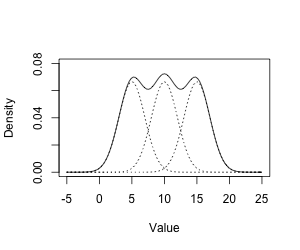
  

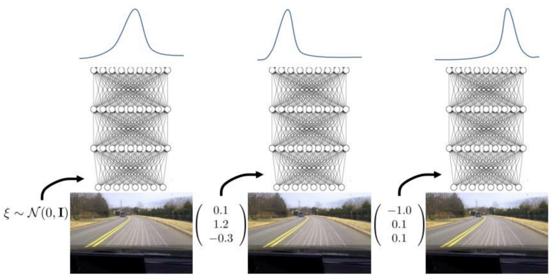

***
### 基于特权教师的模仿学习
- 可能很难直接学习$\pi_\theta(a_t|o_t)$（或者$\pi_\theta(a_t|o_1,...,o_t)$）
- $o_t$是高维的
- 想法：首先获得一个“特权”教师$\pi_p(a_t|p_t)$
  - $p_t$包含一些“真实”信息，学生无法直接获得
  - 然后使用$\pi_p(a_t|p_t)$为$\pi_\theta(a_t|o_t)$生成演示。

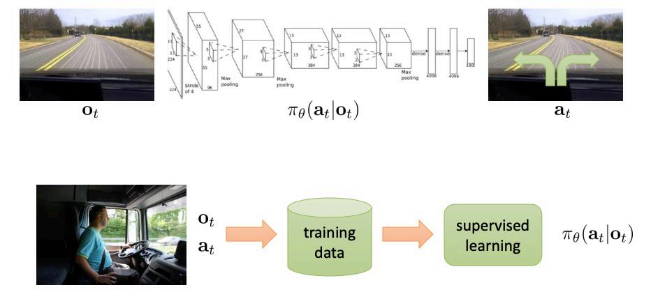

***
### 基于特权教师模仿学习的例子：驾驶
- 阶段1：从专家那里学习一个特权代理
  - 它知道真实状态（交通灯，其他车辆的位置/速度等）
- 阶段2：一个感觉运动学生从这个受训的特权代理人那里学习

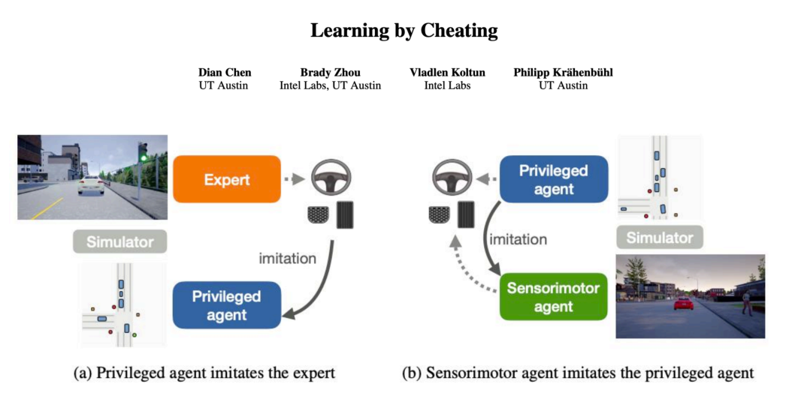

- 为什么它有效（与直接模仿学习相比）？
  - 训练好的“特权代理”是白盒，可以提供你想要的任何监督（例如运行DAgger）
  - 优化可能更容易
  - 内在地提供了一些不变性（例如，夜间/白天驾驶，不同车辆颜色）
  - 容易做数据增强

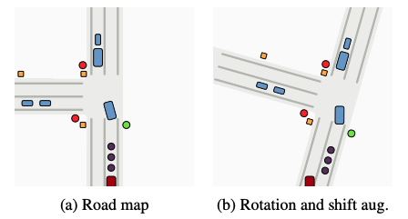

***
### 基于特权教师模仿学习的案例：运动
- 在模拟中，这种特权学习管道更容易、更有用！

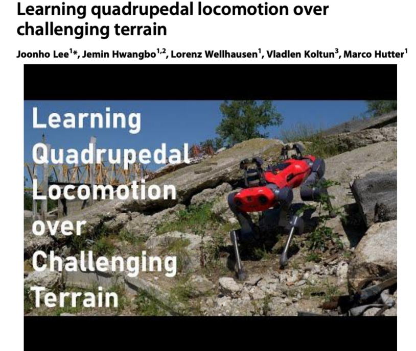
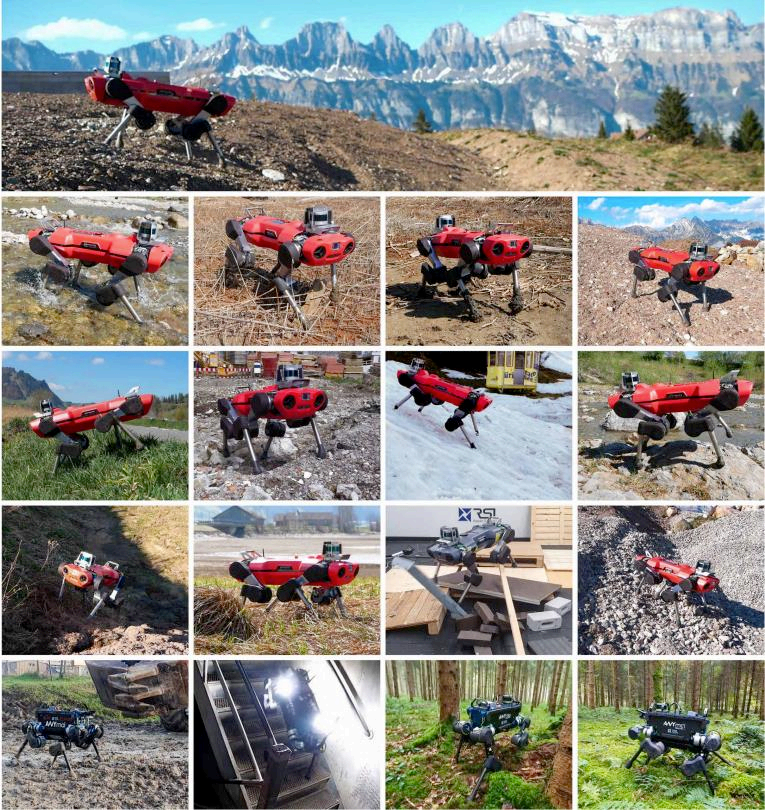

- 特权信息包含了模拟中几乎所有可用的内容（联系、地形、部分、干扰等）
- 学生只能从本体感觉历史（IMU，关节角度等）中学习
- 特权教师使用强化学习进行训练（PPO，不同于驾驶示例）

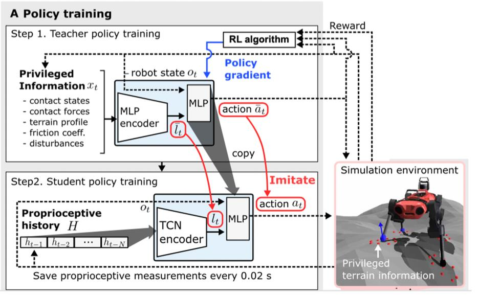

***
### 基于特权教师模仿学习的案例：人形机器人
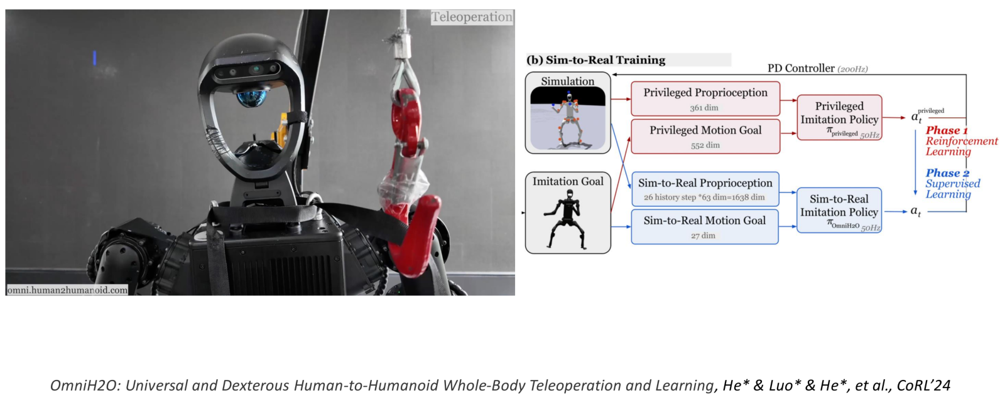

***
### 一些变体：学生学习不在动作空间中
- 学生学习不一定要发生在动作空间中
  - RMA：在潜在空间中

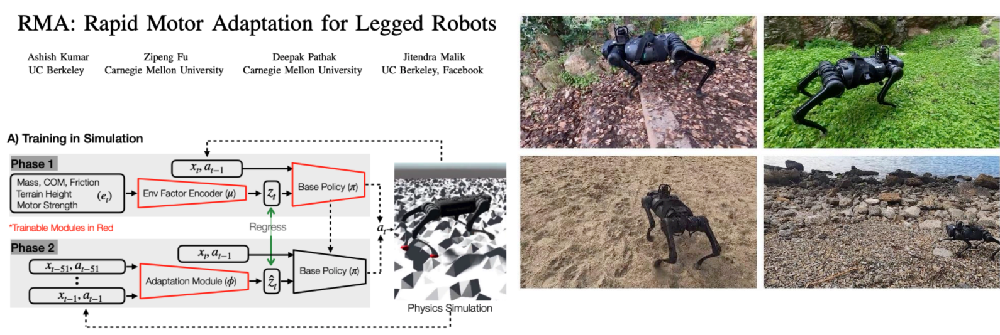

- - ABS：学生预测射线

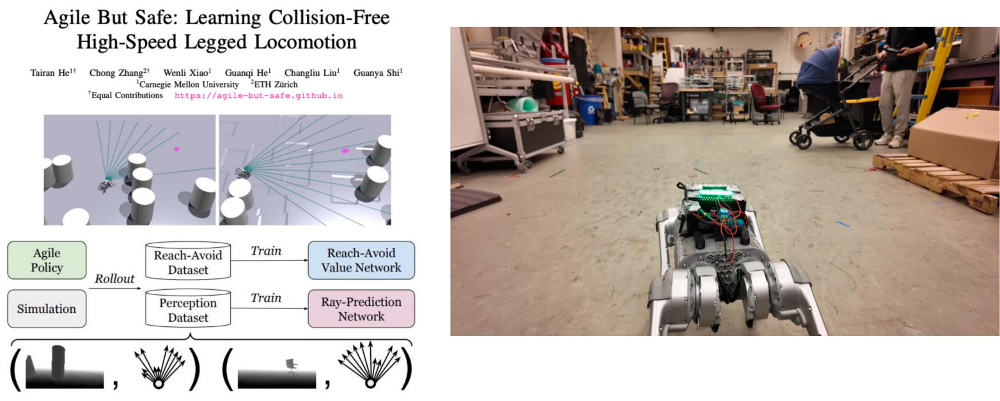

***
### 基于特权教师模仿学习的案例：无人机

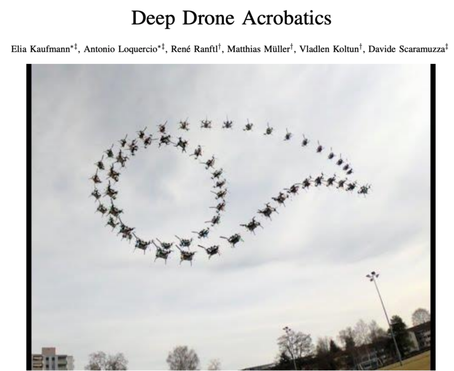

***

  

- 特权教师是MPC控制器
  - 已知状态
  

  

    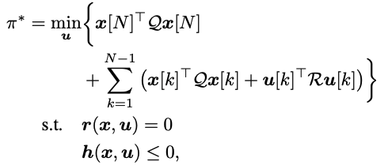
  

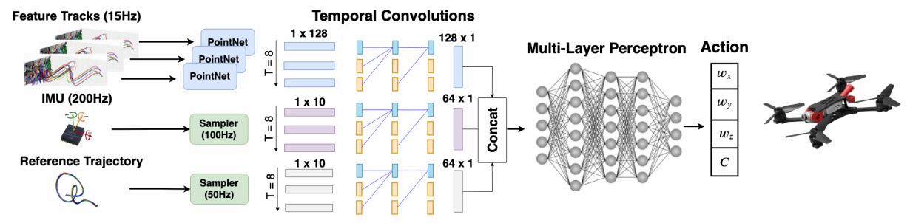

***

  

### 回顾：生成模型
- 什么是生成模型？
  - 学习：学习一个能“匹配”$p_{data}$的分布$p_\theta$
  - 采样：生成新数据，$x_{new}\sim p_\theta$
- 几乎所有类型的生成模型都可以与IL集成
- $p_{data}$来自专家：可以是动作级别，轨迹级别, ...
  

  

    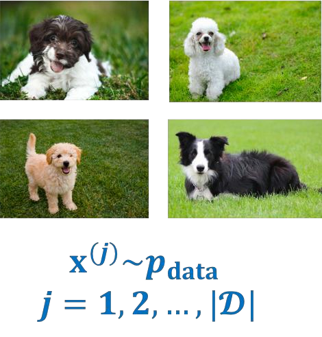
  

- 通常是有条件的

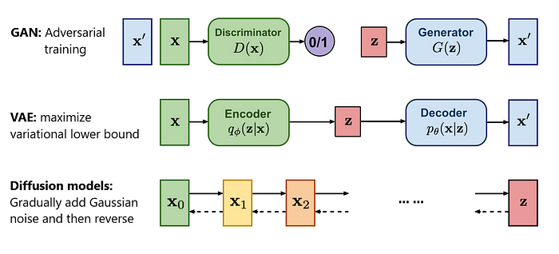

***

  

### GAN+模仿学习（Imitation Learning）
- 生成对抗模仿学习（GAIL）
- 回顾：GAN
- GAIL: $x=(s,a)$
  

  

     
    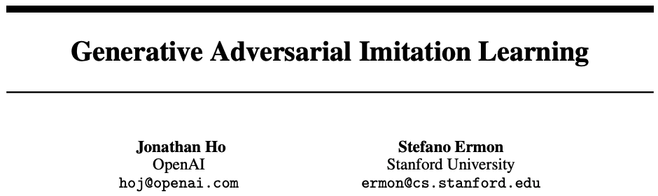
  

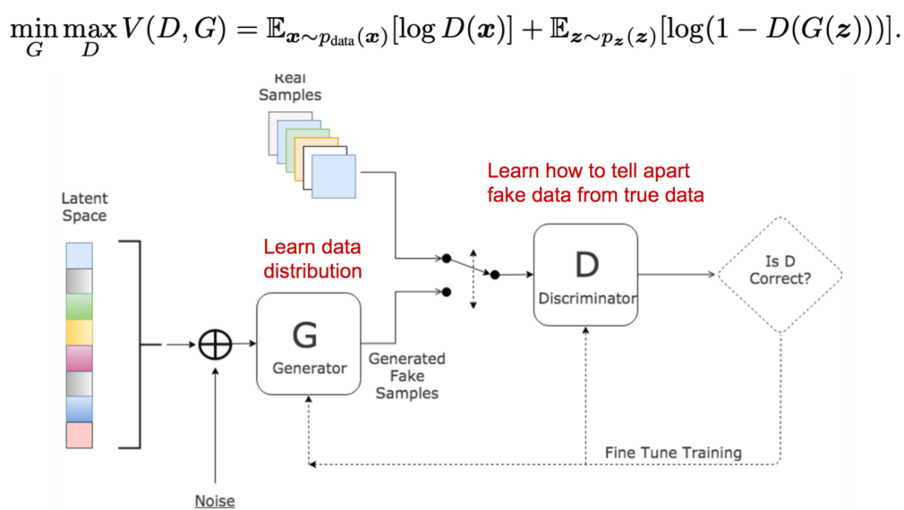

- GAIL的核心思想（重复下面三个步骤）：
  - 从学生模型中采样轨迹
  - 更新判别器，其目的是对教师和学生进行分类
  - 训练学生策略，其目的是最小化判别器的准确性

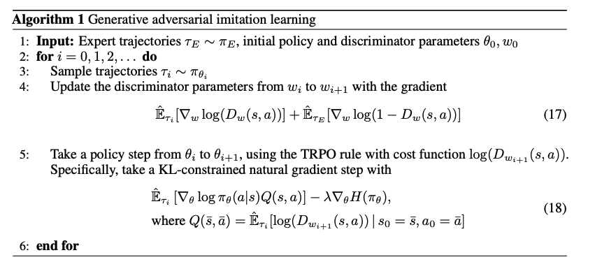

***
### VAE+模仿学习（Imitation Learning）
- 回顾：VAE

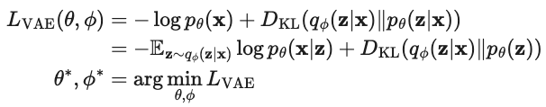
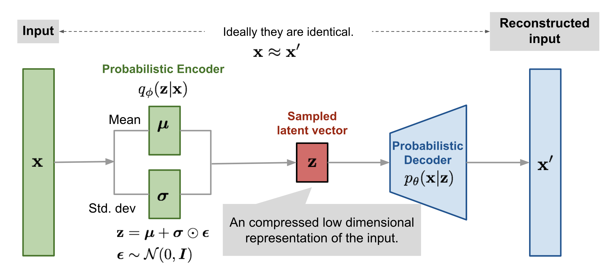

- 例如：基于Transformers的动作分块（ACT）
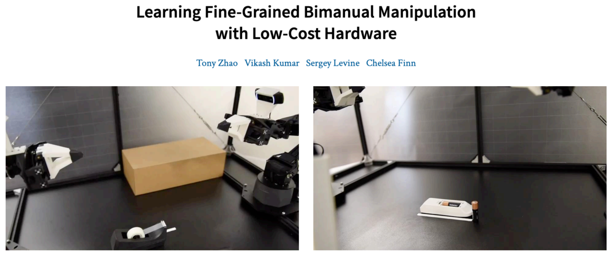
  

  

- 例如：基于Transformers的动作分块（ACT）
  - 基于CVAE（条件VAE）
  - 编码器：专家动作序列+观测 -> 潜在
  - 解码器：潜在+更多观测数据 -> 动作序列预测
  - 关键：动作分块+时间集合
  

  

    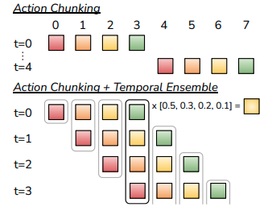
  

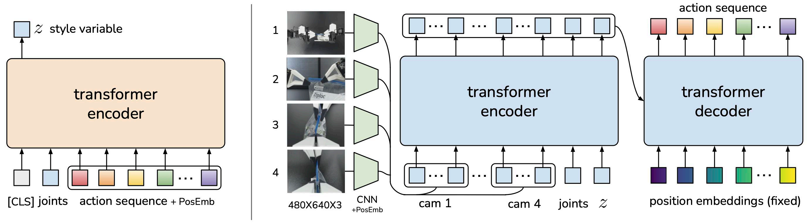

***
### 扩散模型+模仿学习(Diffusion Model + Imitation Learning)
- 回顾：扩散模型

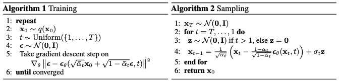

- **前向扩散过程**：对真实数据$x_0$进行采样，并通过独立同部分高斯噪声逐步对其进行腐蚀

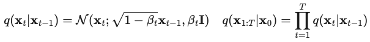
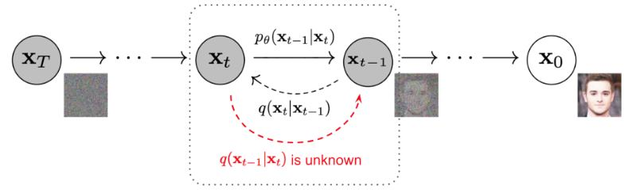

- **逆向扩散过程**：学习高斯分布$p_\theta(x_{t-1}|x_t)$，然后从$x_T$中重建$x_0$

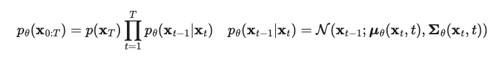

- **随机梯度朗之万动力学**的连接
  - 基于物理学原理的概念。它仅使用对数梯度从$p(x)$中生成样本

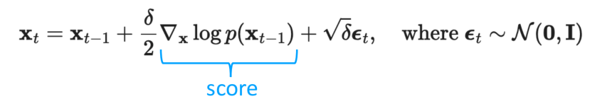

- - 当$t\to\infin, \delta\to 0$时，$x_t$的分布等于真实分布$p(x)$

***
- 例1：
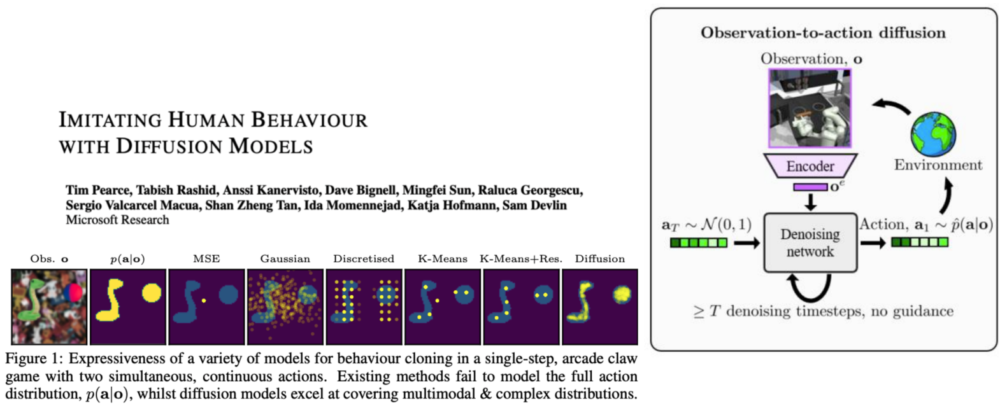

- 例2：
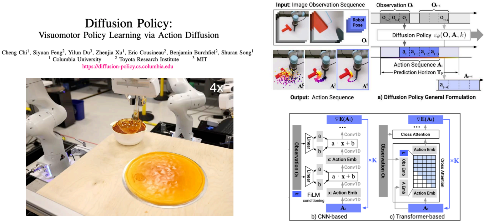

- 例3：pi_0
- 使用流动匹配（基本上等同于扩散）
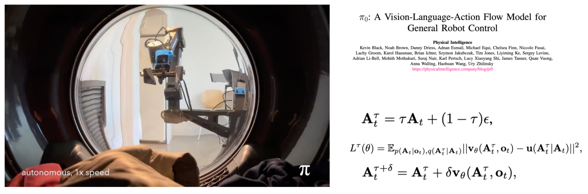

- 例4：扩散器（轨迹层面的扩散）

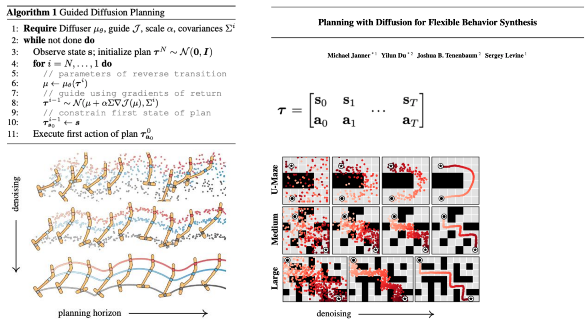

***
### 总结：扩散模型+模仿学习（IL）
- 模仿学习可以与各种生成模型集成：
  - GAN
  - VAE
  - Diffusion models
- 学习到的分布可以是：
  - 动作层面（根据观测条件）$p(a_t|o_t)$
  - 状态-动作（或观测-动作）对$p(s_t,a_t)$
  - 一个动作的序列
  - 完整的状态-动作轨迹