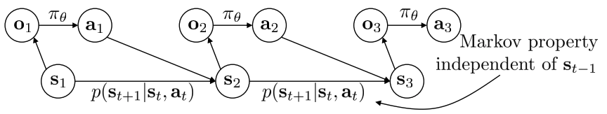
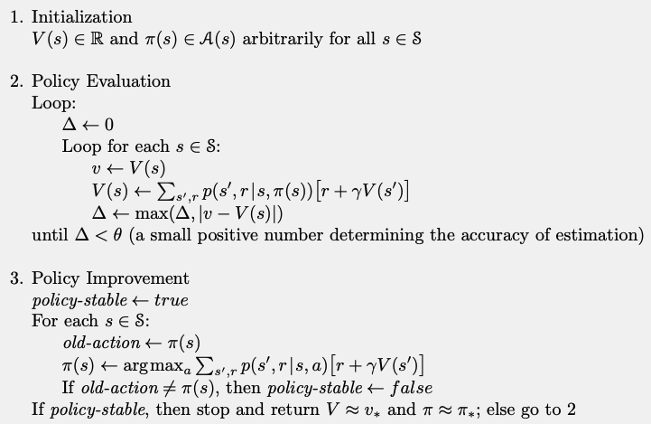

### 大纲
- 为什么是强化学习（RL）？
- 定义：MDP，POMDP，return, value functions
 
- 表格化案例
  - 策略评估 (Policy evaluation)
  - 策略改进
    - 策略迭代
    - 值迭代

***
### 模仿学习的局限性
- 需要专家（例如，人类）
  - 可能很昂贵
- 无法超过专家级别
  - 不足以实现“超级智能”
- 理想情况下，AI应该能够自主学习

***
### 强化学习的成功
- AlphaGo, 2016

    
    

- AlphaZero: 国际象棋，围棋，象棋

    

- AlphaStar: 国际争霸大师级

    

- 跳跃，Cassie的400米短跑（双足）

    

- 使用自我中心视觉在具有挑战性的地形中进行腿部运动

    

- ASAP：对齐仿真和真实世界物理学，学习敏捷的人形整体技能

    

- WoCoCo：人形机器人技能学习（Humanoid Skill Learning）

    

- 动态切换(Dynamic Handover)：用双手投掷和接球(Throw and Catch with Bimanual Hands)

    

- 使用深度强化学习的冠军级无人机比赛

    

***
### 回顾：MDP(Markov decision process, 马尔可夫决策过程)
- 定义(Definiions):
  - $S$是状态空间。$s_t\in S$是时间步$t$的状态
  - $A$是动作空间。$a_t\in A$是时间步$t$的动作
  - $O$是观测空间。$o_t\in O$是时间步$t$的观测结果
  - $p$是一步转移概率（即动力学）：$s_{t+1}\sim p(\cdot|s_t, a_t)$
  - $h$是观测模型：$o_t\sim h(\cdot|s_t)$
  - $r:S\times A \rightarrow \mathbb{R}$ 是奖励函数
 

- 一个马尔可夫决策过程（MDP）是一个由$(S, A, p, r)$组成的元组
  - 目标：学习一个策略$\pi_\theta(a_t|s_t)$

    

***
### 回顾：POMDP(Partially observed Markov decision process, 部分可观测的马尔可夫决策过程)
- 定义(Definiions):
  - $S$是状态空间。$s_t\in S$是时间步$t$的状态
  - $A$是动作空间。$a_t\in A$是时间步$t$的动作
  - $O$是观测空间。$o_t\in O$是时间步$t$的观测结果
  - $p$是一步转移概率（即动力学）：$s_{t+1}\sim p(\cdot|s_t, a_t)$
  - $h$是观测模型：$o_t\sim h(\cdot|s_t)$
  - $r:S\times A \rightarrow \mathbb{R}$ 是奖励函数
 

- 一个部分可观测的马尔可夫决策过程（POMDP）是一个由$(S, A, O, p, h, r)$组成的元组
  - 目标：学习一个策略$\pi_\theta(a_t|o_t)$

    

***
### 回顾：马尔可夫性质
- 定义(Definiions):
  - $S$是状态空间。$s_t\in S$是时间步$t$的状态
  - $A$是动作空间。$a_t\in A$是时间步$t$的动作
  - $O$是观测空间。$o_t\in O$是时间步$t$的观测结果
  - $p$是一步转移概率（即动力学）：$s_{t+1}\sim p(\cdot|s_t, a_t)$
  - $h$是观测模型：$o_t\sim h(\cdot|s_t)$
  - $r:S\times A \rightarrow \mathbb{R}$ 是奖励函数
 

  

 

- 为什么是马尔可夫？
  - 一旦状态已知，就允许我们丢弃历史数据

  

  

    
  

***
### 回顾：强化学习（RL）的目标
- 有限时间范围情况下：$T$是有限的
- 无限时间范围情况下：$T=\infin$
- 累积奖励通常会被**折扣**：$\sum_t\gamma^tr(s_t, a_t)$， 这里$0<\gamma\leq1$
- 目标：找到一个策略来**最大化累积奖励**
  - 例如：网格世界

***
### 概念解释：1维网格世界

- 4个状态：$s(1)$(开始)，$s(2), s(3), s(4)$
- 3个动作：向左，向右，停留
 
- **$\color{red}{}0\leq\pi(a|s)\leq1$** 是π在状态s时，选择a的概率
- 例如（一个智能确定性策略）：**$\color{red}{}\pi(a=“向右”|s(2))=1$**
- 例如（一个随机策略）：对所有动作有 **$\color{red}{}\pi(a|s(2))= 1/3$**
 
- **$\color{red}{}0\leq p(s'|s,a)\leq1$**，是采取动作$a$时，状态从$s$转移到$s'$的概率
- 例如（确定性系统）：**$\color{red}{}p(s(s)|s(2),a=“向右”)=1$**
- 例如（随机系统）：**$\color{red}{}p(s(3)|s(2), a=“向右”)=0.9,  p(s(2)|s(2), a=“向右”)=1$**

***
### 回报$G_t$
- 未来奖励的总和

$G_t=r_{t+1}+\gamma r_{t+2}+\gamma^2r_{t+3} ... = \sum_{k=0}^\infin\gamma^k r_{t+k+1}$

- 情景式场景设定(episodic setting)(有限时间范围)：

$G_t=r_{t+1}+r_{t+2}+\cdot\cdot\cdot+r_T$

- 动作序列是$s_0, a_0, r_1, s_1, a_1, r_2, ...$
  - 一些书/论文可能使用不同的索引

***
### 价值函数
- 状态-价值函数(V)：从状态$s$出发，然后按照策略$\pi$的预期回报

$V^\pi(s)=\mathbb{E}_\pi[G_0|s_0=s]$

- 动作价值函数(Q)：从状态$s$出发，采取动作$a$，然后遵循策略$\pi$的预期回报

$Q^\pi(s,a)=\mathbb{E}_\pi[G_0|s_0=s,a_0=a]$

- 问题：为什么我们需要$V$和$Q$？$Q^\pi(s,a)>V^\pi(s)$意味着什么？

***
### 最优价值函数(Optimal Value Functions)
- 最优值V(Optimal V)：

$V^*(s)=\underset{\pi}{max} V^\pi(s)=\underset{\pi}{max}\mathbb{E}_\pi[G_0|s_0=s]$

- 最优值Q(Optimal Q):

$Q*(s,a)=\underset{\pi}{max}Q^\pi(s,a)=\underset{\pi}{max}\mathbb{E}_\pi[G_0|s_0=s,a_0=a]$

- 最优策略(Optimal policy):

$\pi^*(s)=\underset{\pi}{argmax}V^\pi(s)$

- 性质(Properties)：

$V^*(s)=\underset{a}{max}Q^*(s,a) \qquad \qquad\pi^*(s)=\underset{a}{argmax}Q^*(s,a)$

- 如果我们知道$Q^*(s,a)$，我们马上就能得到最优策略
  - 如果我们只知道$V^*(s)$，我们需要动态地向前看一步来选择最优动作

***
### 例如：一维网格世界

- 4个状态：$s(1)$(开始)，$s(2), s(3), s(4)$
- 3个动作：向左，向右，停留
 

- 假如没有折扣和确定性转移
- **$\color{red}V^*(s(1))=-3,V^*(s(2))=-2,V^*(s(3))=-1,V^*(s(4))=0$**
- **$\color{red}Q^*(s(1),a=“停留”)=-4,Q^*(s(1),a=“向右”)=-3$**，那么 **$\color{red}\pi^*(s(1))=“向右”$** 

***
### 策略评估（Policy Evaluation）
- 目标：给定一下策略$\pi$（可能不是最优的），计算它的价值函数

$V^\pi(s)=\mathbb{E}_\pi[G_0|s_0=s]$
$Q^\pi(s,a)=\mathbb{E}_\pi[G_0|s_0=s, a_0=a]$

- 返回值的递归关系
  - 一步奖励+折扣的下一步回报

$G_t=r_{t+1}+\gamma r_{t+2}+\gamma^2r_{t+3} ... = \sum_{k=0}^\infin\gamma^k r_{t+k+1}$
$=r_{t+1}+\gamma(r_{t+2}+\gamma r_{t+3}+...)=r_{t+1}+\gamma G_{t+1}$

- 利用递归关系：

$V^\pi(s)=\mathbb{E}_\pi[G_0|s_0=s]$
$=\mathbb{E}_\pi[r_1+\gamma G_1|s_0=s]$
$=\underset{a}{\sum}\pi(a|s)\underset{s',r}{\sum}p(s',r|s,a)[r+\gamma\cdot V^\pi(s')]$

- $\mathbb{E}_\pi[\cdot\cdot\cdot]$意味着平均所有的随机性
  - 策略$\pi$是随机的
  - 转移$p$是随机的
- 第三个方程：我们扩展了期望
 

- 简化一点（假设$r$是状态的确定性函数）

- 对于Q：

- 对于表格案例（网格世界），这是一组线性方程，$V^\pi$是其唯一解
- 矩阵形式

$V^\pi=r+\gamma T^\pi V^\pi$

- 假设存在S个状态：$s_1,s_2,\cdot\cdot\cdot$
  - $T^\pi$是一个$S\times S$维的矩阵，其元素$(j,k)$给出概率$p(s_k|s_j,a=\pi(sj))$
  - $T^\pi$常被称为随机矩阵（每行之和为1，$T^\pi\bm{1}=\bm{1}$）
  - $V^\pi$是一个S维向量，其第j个元素给出$V^\pi(s_j)$
  - $r$是一个S维向量，其第j个元素给出$r(s_j)$
- 然后我们有了一个闭式解：$V^\pi=(I-\gamma T^\pi)^{-1}r$
- 或者我们可以进行迭代策略评估$V_{k+1}=r+\gamma T^\pi V_k$直到收敛
- 问题：为什么它会收敛？为什么$I-\gamma T^\pi$是可逆的？
  - 这是一个收缩映射！

***
### 收缩（Contraction）
- 在赋范向量空间上，算子F是$\gamma$收缩，前提：

$||F(x)-F(y)||\leq\gamma||x-y||, \forall x,y$

- 如果$F$是一个$\gamma$收缩:
  - $x_{k+1}=F(x_k)$在向量空间中收敛到**唯一**的不动点
  - 收敛速率是线性的（即呈指数级收敛）
- 在策略评估中的Bellman算子是一种收缩：$F^\pi(V)=r+\gamma T^\pi V$

- 一个更简单的证明：$||T^\pi||_\infin = 1$。因此

$||F^\pi(U)-F^\pi(V)||_\infin = |\gamma T^\pi(U-V)||_\infin \leq\gamma||T^\pi||_\infin||U-V||_\infin=\gamma||U-V||_\infin$

***

  

### 例如：2维网格世界

  

  

    
  

***
### 策略评估总结
- 目标：给定一些策略$\pi$（可能不是最优的），计算它的价值函数

$V^\pi(s)=\mathbb{E}_\pi[G_0|s_0=s]$
$Q^\pi(s,a)=\mathbb{E}_\pi[G_0|s_0=s,a_0=a]$

- 使用上述递归关系（**贝尔曼方程（Bellman equation）**）
- 称为“动态规划”
- 由于收缩而产生的收敛保证
- 需要了解动态特性

***
### 策略改进
- 目标：迭代地改进策略

- 一个直观的想法：$\pi'(s)=\underset{a}{argmax}Q^\pi(s,a)$
  - 即，“贪婪地”更新策略一优化先前策略的Q值
- 它有效吗？
- 是的！**策略改进定理**：如果$Q^\pi(s,\pi'(s))\geq V^\pi(s), \forall s,$ 那么，$V^{\pi'}(s)\geq V^\pi(s),\forall s$
- 证明

- 当$\pi(s)=\underset{a}{argmax}Q^\pi(s,a)$时，策略是不变的吗？
- 贝尔曼最优方程（Bellman optimality equations）

$V^*(s)=\underset{a}{max}Q^*(s,a)$
$\pi^*(s)=\underset{a}{argmax}Q^*(s,a)$

- 使用最优性原则

$V^*(s)=\underset{a}{max}\underset{s',r}{\sum}p(s',r|s,a)[r+\gamma\cdot V^*(s')]$
$Q^*(s,a)=\underset{s',r}{\sum}p(s',r|s,a)[r+\gamma\cdot\underset{a'}{max}Q^*(s',a')]$

***
### 使用V进行策略迭代
- 也可以执行Q值函数（策略评估更复杂，但更容易改进）

***
### 通用策略迭代
- 策略评估与策略改进的任意交错
- （几乎）所有的RL方法都是通用策略迭代（GPI）的一种形式

***
### 值迭代
- 策略迭代包括一个迭代的策略评估步骤
- 我们可以把它移除吗？
- 是的，考虑一下贝尔曼最优方程：

$V^*(s)=\underset{a}{max}Q^*(s,a)=\underset{a}{max}\underset{s'}{\sum}p(s',r|s,a)[r+\gamma\cdot V^*(s')]$

- 想法：直接更新值函数

***
### 总结
- 贝尔曼最优性方程是非线性的
- 在**已知动态的表格案例**中，我们可以进行基于DP的策略改进
- 在一般的RL设置中，**近似**求解贝尔曼最优性方程

